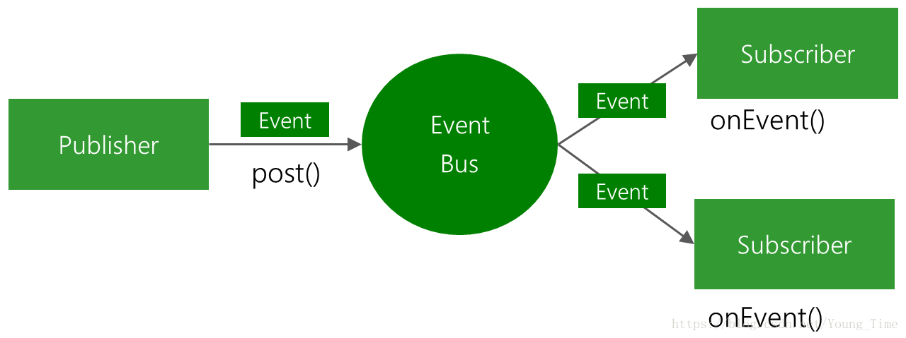
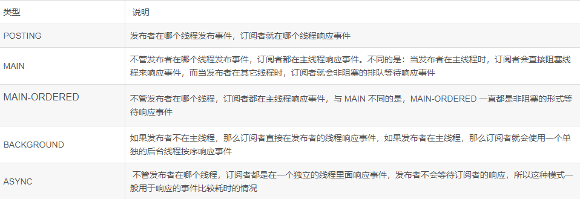
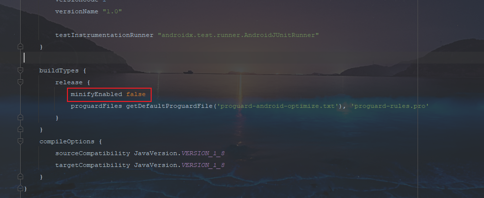

## EventBus

### EventBus介绍

EventBus是greenrobot开发的**发布/订阅事件总线**组件，也是基于观察者模式，不同点在于，EventBus框架解耦了事件的发送和定于模块，事件对象的分发由EventBus来处理




### EventBus仓库地址

[GitHub地址](https://github.com/greenrobot/EventBus)


### EventBus实现步骤

添加依赖

```xml
implementation("org.greenrobot:eventbus:3.3.1")
```


#### 1、定义

```java
public static class MessageEvent{
    /*逻辑代码*/
};
```


#### 2、注册事件

```java
@Override
protected void onStart() {
    super.onStart();
    //注册EventBus
    EventBus.getDefault().register(this);
}

@Override
protected void onStop() {
    super.onStop();
    //解除注册
    EventBus.getDefault().unregister(this);
}
```


#### 3、准备订阅

```java
@Subscribe(threadMode=ThreadMode.MAIN)
public void onMessageEvent(MessageEvent event){
    /*逻辑代码*/
};
```


#### 4、发布事件

```java
EventBus.getDefault().post(new MessageEvent());
```


### EventBus线程模式

```java
POSTING模式（订阅的发布模式）：默认的模式，发布函数 --- 订阅函数，处于相同的线程，同步（阻塞）
MAIN模式（主线程模式）：订阅函数用于处于主线程，同步（阻塞）
MAIN_OREDRED模式（主线程订阅模式）：订阅函数用于处于主线程，异步（不阻塞）
BACKGROUND模式（后台运行模式）：订阅函数永远处于子线程（如果发布函数为主线程，接收函数则新开一个线程，否则使用发布函数的子线程），异步（不阻塞）
ASYNC模式（异步模式）：不管发布函数处于何种线程，订阅函数都新开一个线程，异步（不阻塞）
```




### EventBus粘性事件

有时候实现一个效果，需要组件化之间的通信，有时候会出现异步的情况，事件接收方还没有准备好事件就已经发送过来，所以就可以使用EventBus的粘性事件

EventBus粘性事件会先将信息保留，等事件接收方准备好后再将数据发送出去


实现步骤：

1、EventBus.getDefault().postSticky(messageEventBus);将数据先保留

2、接收方@Subscribe(sticky = true)


### 嵌入式规则

有时候生成APK，为了将APK的大小压缩成最小的，会在**build.gradle**文件中将minifyEnabled设置为true，而设置成true后会将没有调用的方法给剔除掉，而我们订阅的方法是没有被调用的，所有会被剔除掉




解决方法：在proguard-rules.pro文件中设置规则

[EventBus规则地址](https://github.com/greenrobot/EventBus/blob/master/eventbus-android/consumer-rules.pro)

```
-keepattributes *Annotation*
-keepclassmembers class * {
    @org.greenrobot.eventbus.Subscribe <methods>;
}
-keep enum org.greenrobot.eventbus.ThreadMode { *; }

# If using AsyncExecutord, keep required constructor of default event used.
# Adjust the class name if a custom failure event type is used.
-keepclassmembers class org.greenrobot.eventbus.util.ThrowableFailureEvent {
    <init>(java.lang.Throwable);
}

# Accessed via reflection, avoid renaming or removal
-keep class org.greenrobot.eventbus.android.AndroidComponentsImpl
```


### 实现案例1：Activity和Service组件之间相互通信

#### 定义数据的Bean类

```java
//MessageEventBus类
public class MessageEventBus {
    private String message;

    public String getMessage() {
        return message;
    }

    public void setMessage(String message) {
        this.message = message;
    }
}

//MessageEventBus2
public class MessageEventBus2 {
    private int num;

    public int getNum() {
        return num;
    }

    public void setNum(int num) {
        this.num = num;
    }
}
```


#### Activity布局

```xml
<?xml version="1.0" encoding="utf-8"?>
<LinearLayout xmlns:android="http://schemas.android.com/apk/res/android"
    xmlns:app="http://schemas.android.com/apk/res-auto"
    xmlns:tools="http://schemas.android.com/tools"
    android:layout_width="match_parent"
    android:layout_height="match_parent"
    android:orientation="vertical"
    tools:context=".eventBus2.EventBus2Activity">

    <TextView
        android:id="@+id/receive"
        android:layout_width="match_parent"
        android:layout_height="wrap_content"
        android:text="接收到的信息为："
        android:textSize="18sp"/>

    <Button
        android:layout_width="wrap_content"
        android:layout_height="wrap_content"
        android:text="开启Service"
        android:onClick="startService"/>

    <Button
        android:layout_width="wrap_content"
        android:layout_height="wrap_content"
        android:text="发布事件"
        android:onClick="sendEventBus"/>

</LinearLayout>
```

#### Activity实现功能

```java
public class EventBus2Activity extends AppCompatActivity {

    TextView receive;

    @Override
    protected void onCreate(Bundle savedInstanceState) {
        super.onCreate(savedInstanceState);
        setContentView(R.layout.activity_event_bus2);

        receive = findViewById(R.id.receive);
    }

    @Override
    protected void onStart() {
        super.onStart();
        //注册EventBus
        EventBus.getDefault().register(this);
    }

    @Override
    protected void onDestroy() {
        super.onDestroy();
        //取消注册EventBus
        EventBus.getDefault().unregister(this);
    }

    @Subscribe
    public void subscribeEventbus(MessageEventBus messageEventBus){
        //获取Service发送过来的数据
        receive.setText("接收到的数据为：" + messageEventBus.getMessage());
    }

    /**
     * 启动Service
     * @param view
     */
    public void startService(View view) {
        Intent intent = new Intent(this, MyService.class);
        startService(intent);
    }

    /**
     * 发布信息
     * @param view
     */
    public void sendEventBus(View view) {
        MessageEventBus2 messageEventBus2 = new MessageEventBus2();
        messageEventBus2.setNum(10);

        //发布事件
        EventBus.getDefault().post(messageEventBus2);

        Toast.makeText(this, "发布成功！！！", Toast.LENGTH_SHORT).show();
    }
}
```


#### Service类

```java
public class MyService extends IntentService {

    int i = 0;
    MessageEventBus messageEventBus;

    public MyService() {
        super("name");

        messageEventBus = new MessageEventBus();
    }

    @Override
    public void onStart(@Nullable Intent intent, int startId) {
        super.onStart(intent, startId);
        //注册EventBus
        EventBus.getDefault().register(this);
    }

    @Override
    public void onDestroy() {
        super.onDestroy();
        //取消注册EventBus
        EventBus.getDefault().unregister(this);
    }

    @Subscribe(threadMode = ThreadMode.ASYNC)
    public void subscribeEventbus(MessageEventBus2 messageEventBus2){
        //获取Activity发送的数据
        i = messageEventBus2.getNum();
    }

    @Override
    protected void onHandleIntent(@Nullable Intent intent) {
        for (; i < 100; i++) {
            Log.e("TAG", "onHandleIntent: " + i);
            messageEventBus.setMessage("" + i);

            //发布事件
            EventBus.getDefault().post(messageEventBus);

            try {
                Thread.sleep(1000);
            } catch (InterruptedException e) {
                e.printStackTrace();
            }
        }
    }
}
```


### 实现案例2：实现EventBus的粘性事件，实现页面跳转发送数据

#### 数据Bean类

```java
public class MessageEventBus {
    private String message;

    public String getMessage() {
        return message;
    }

    public void setMessage(String message) {
        this.message = message;
    }
}

```


#### Activity1

```java
public class EventBus3Activity1 extends AppCompatActivity {

    @Override
    protected void onCreate(Bundle savedInstanceState) {
        super.onCreate(savedInstanceState);
        setContentView(R.layout.activity_event_bus31);
    }

    /**
     * 跳转按钮
     * @param view
     */
    public void jump(View view) {
        Intent intent = new Intent(this, EventBus3Activity2.class);

        //事件发布
        MessageEventBus messageEventBus = new MessageEventBus();
        messageEventBus.setMessage("这是发送的数据");
        EventBus.getDefault().postSticky(messageEventBus);

        startActivity(intent);
    }
}
```


#### Activity2布局文件

```xml
<?xml version="1.0" encoding="utf-8"?>
<LinearLayout xmlns:android="http://schemas.android.com/apk/res/android"
    xmlns:app="http://schemas.android.com/apk/res-auto"
    xmlns:tools="http://schemas.android.com/tools"
    android:layout_width="match_parent"
    android:layout_height="match_parent"
    tools:context=".eventBus3.EventBus3Activity2">

    <TextView
        android:id="@+id/receiveMessage"
        android:layout_width="match_parent"
        android:layout_height="wrap_content"
        android:text="接收到的信息：1"
        android:textSize="18sp"/>

</LinearLayout>
```


#### Activity2

```java
public class EventBus3Activity2 extends AppCompatActivity {

    TextView receiveMessage;

    @Override
    protected void onCreate(Bundle savedInstanceState) {
        super.onCreate(savedInstanceState);
        setContentView(R.layout.activity_event_bus32);

        receiveMessage = findViewById(R.id.receiveMessage);
    }

    @Override
    protected void onStart() {
        super.onStart();
        //注册EventBus
        EventBus.getDefault().register(this);
    }

    @Override
    protected void onDestroy() {
        super.onDestroy();
        //取消注册EventBus
        EventBus.getDefault().unregister(this);
    }

    @Subscribe(sticky = true)
    public void receiveStickyEvent(MessageEventBus messageEventBus){
        //获取Activity1发送的数据
        receiveMessage.setText("接收到粘性事件：" + messageEventBus.getMessage());
    }
}
```

