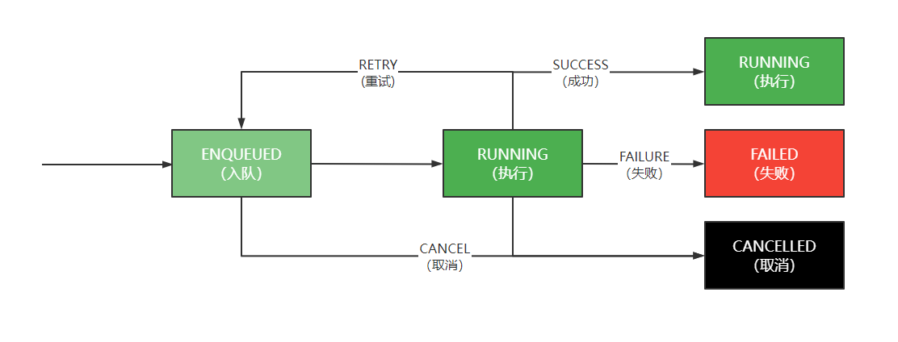
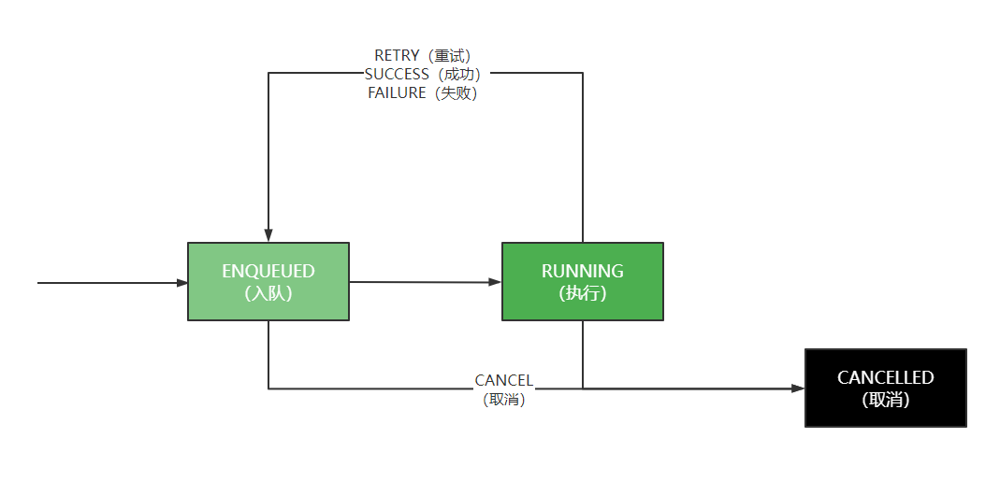
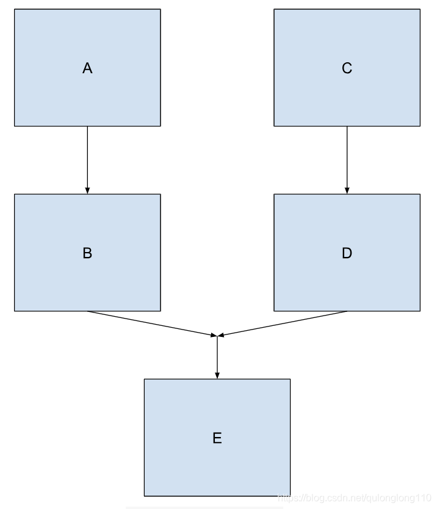

## WorkManager

WorkManager是适合用于持久性工作的推荐解决方案，为应用程序中那些不需要及时完成的任务提供了一个统一的解决方案，以便在设备电量和用户体验之间达到一个比较好的平衡


例如：App的关注功能，如果用户在弱网的情况下点击关注按钮，此时用户由于某种原因马上退出App，但是关注的请求并没有成功发送给服务端，那么下次用户再进入时，拿到的还是之前未关注的状态信息，这就产生了操作上的Bug，降低了用户的体验，增加了用户不必要的操作

这个时候使用WorkManger就可以轻松解决了


### 持久性工作的类型

可以处理三种类型的永久性工作

- 立即执行：必须立即开始且很快就完成的任务，可以加急
- 长时间运行：运行实践可能较长（有可能超过10分钟）的任务
- 可延期执行：延期开始并且可以定期运行的预定任务

| 类型     | 周期           | 使用方式                                                     |
| -------- | -------------- | ------------------------------------------------------------ |
| 立即     | 一次性         | OneTimeWorkRequest和Worker<br />如果需要处理加急工作，使用OneTimeWorkRequest调用setExpedited() |
| 长期运行 | 一次性或者定期 | 任意WorkRequest或者Worker<br />在工作器中调用setForeground()来处理通知 |
| 可延期   | 一次性或者定期 | PeriodicWorkRequest和Worker                                  |


### 使用入门

添加依赖：

```
dependencies {    
    implementation "androidx.work:work-runtime:2.7.1"
}
```


#### 定义工作

工作使用Worker类定义。`doWork()`方法在WorkManager提供的后台线程上异步运行

```java
public class MyWork extends Worker {
    public MyWork(@NonNull Context context, @NonNull WorkerParameters workerParams) {
        super(context, workerParams);
    }

    @NonNull
    @Override
    public Result doWork() {
        Log.e("TAG", "doWork...");

        return Result.success();
    }
}
```

从`doWork()`返回的`Result`会通知WorkManager服务工作是否成功，以及工作失败时是否重试工作

- Result.success()：工作成功完成
- Result.failure()：工作失败
- Result.retry()：工作失败，应根据其重试政策在其他时间尝试
- Result.success(Data outputData)
- Result.failure(Data outputData)


#### 创建WorkRequest

创建一个请求，有两种方式：

- 一种是只执行一次的OneTimeWorkRequest

```java
OneTimeWorkRequest workRequest = new OneTimeWorkRequest.Builder(MyWork.class).build();
```

- 另一种是循环执行的PeriodicWorkRequest，定义的最短重复间隔是15分钟

```java
PeriodicWorkRequest workRequest = new PeriodicWorkRequest.Builder(MyWork.class, 1, TimeUnit.HOURS).build();
```


#### 将工作提交给系统

最后，需要使用`enqueue()`方法将`WorkRequest`提交到`WorkManager`

```java
//将工作提交给系统
WorkManager workManager = WorkManager.getInstance(this);
workManager.enqueue(workRequest);
```


### 调度一次性工作

#### 状态

在`ENQUEUED`状态下，工作会满足其`Constraints`和初始延迟计时时要求后立即运行

接下来，该工作会转为`RUNNING`状态，然后可能会根据工作的结果转为`SUCCEEDED`、`FAILED`状态，或者结果是`retry`，它可能会回到`ENQUEUED`状态

在此过程中，随时可以取消工作，取消后工作将进入`CANCELLED`状态



`SUCCEEDED`、`FAILED`、`CANCELLED`均表示此工作的终止状态

如果当前当前工作处于上述的状态，`WorkInfo.State.isFinished()`都将返回true


#### 代码实现

对于无需额外配置的简单工作，可以使用`from`，代码如下：

```java
OneTimeWorkRequest workRequest = OneTimeWorkRequest.from(MyWork.class);
```

对于更加复杂的工作，可以使用构造器，代码如下：

```java
OneTimeWorkRequest workRequest = new OneTimeWorkRequest.Builder(MyWork.class).build();
```


### 调度定期工作

#### 状态

定期工作只有一个终止状态`CANCELLED`，这是因为定期工作永远不会结束，每次运行后，无论结果如何，系统都会重新对其进行调度



#### 代码实现

有时可能需要定期运行某些工作。例如：可能要定期备份数据、定期下载应用中的新鲜内容或者定期上传日志到服务器

```java
PeriodicWorkRequest workRequest = new PeriodicWorkRequest.Builder(MyWork.class, 1, TimeUnit.HOURS).build();
```


### 调用加急工作

- OutOfQuotaPolicy.RUN_AS_NON_EXPEDITED_WORK_REQUEST：这会导致作业作为普通工作请求运行
- OutOfQuotaPolicy.DROP_WORK_REQUEST：这会在配额不足时导致请求取消

```java

```


### 工作约束

约束可以确保将工作延迟到满足最佳条件时运行，以下约束适用于WorkManager

- NetworkType：约束运行工作所需的网络类型
  - NetworkType.NOT_REQUIRED：对网络没有要求
  - NetworkType.CONNECTED：网络连接的时候执行
  - NetworkType.UNMETERED：不计费的网络，比如：WIFI下执行
  - NetworkType.NOT_ROAMING：非漫游网络状态
  - NetworkType.METERED：计费网络，比如：3G、4G下执行
- BatteryNotLow：如果设置为true，那么当设备处于“电量不足模式”时，工作不会运行
- RequiresCharging：如果设置为true，那么工作只能在设备充电时运行
- Deviceldle：如果设置为true，则要求用户设备必须处于空闲状态，才能运行工作。在运行批量操作时，此约束会非常有用；若是不用此约束，批量操作可能会降低用户设备上正在积极运行的其他应用的性能
- StorageNotLow：如果设置为true，那么当用户设备上的存储空间不足时，工作不会运行

例如：构建一个工作请求，该工作请求仅在用户设备在充电并且连接到WIFI网络时才会运行：

```java
Constraints constraints = new Constraints.Builder()
    .setRequiredNetworkType(NetworkType.UNMETERED)
    .setRequiresCharging(true)
    .build();

OneTimeWorkRequest workRequest = new OneTimeWorkRequest
    .Builder(MyWork.class)
    .setConstraints(constraints)
    .build();
```


### 延迟工作

如果工作没有约束，或者当工作加入队列时所有约束都得到满足，那么系统会选择立即运行该工作

如果不希望工作立即运行，可以将工作指定为在经过一段最短初始延迟时间后再启动

```java
OneTimeWorkRequest workRequest = new OneTimeWorkRequest
    .Builder(MyWork.class)
    .setConstraints(constraints)
    .setInitialDelay(10, TimeUnit.SECONDS)
    .build();
```


### 重试和退避政策

如果需要让WorkManager重试工作，可以从工作器返回`Result.retry()`，然后，系统会根据退避延迟实践和退避政策重新调度工作

- 当指定退避延迟时间的值，值不能超过10秒或者MIN_BACKOFF_MILLIS
- 退避政策定义了在后续重试过程中，退避延迟时间随时间是怎样方式增长，有两种退避政策
  - LINEAR：线性增长的方式
  - EXPONENTIAL：指数增长的方式

```java
OneTimeWorkRequest workRequest = new OneTimeWorkRequest.Builder(MyWork.class)
                .setBackoffCriteria(BackoffPolicy.LINEAR, OneTimeWorkRequest.MIN_BACKOFF_MILLIS, TimeUnit.MILLISECONDS)
                .build();
```

以上示例中，最短退避延迟时间设置为允许的最小值，即10秒

由于政策为`LINEAR`，每次重试，重试的间隔都会增加约10秒。例如：第一次结束后并在10秒后重试，如果接下来工作继续返回`Result.retry()`，那么接下来会在20、30、40秒后重试

如果退避政策为`EXPONENTIAL`，那么重试时长将接近20、40、80秒，以此类推


### 标记工作

每个工作请求都有一个唯一标识符，该标识符可用于在以后标识该工作，以便**取消工作**或者**观察进度**

可以通过标记，来处理一组工作请求

```java
OneTimeWorkRequest workRequest = new OneTimeWorkRequest.Builder(MyWork.class)
    .addTag("cleanup")
    .build();
```

可以通过`WorkInfo.getTags()`获取与`WorkRequest`关联的标记集

处理工作请求：

- WorkManager.cancelAllWorkByTag(String)：会取消带有特定标记的所有工作请求
- WorkManager.getWorkInfosByTag(String)：返回一个WorkInfo对象列表，该列表可用于确定当前工作状态


### 参数传递

有些情况下可能需要输入数据才能正常运行，例如：处理图片上传的工作可能需要使用待上传图片的URI作为输入数据

**输入值以键值对的形式存储在Data对象中，并且可以在工作请求中设置，WorkManager会在执行工作时将输入Data传递给工作**

Worker类可以通过调用Worker.getInputData()访问输入参数

```java
public class MyWork extends Worker {
    public MyWork(@NonNull Context context, @NonNull WorkerParameters workerParams) {
        super(context, workerParams);
    }

    @NonNull
    @Override
    public Result doWork() {
        String imageUri = getInputData().getString("IMAGE_URI");

        if (imageUri == null){
            Log.e("LCXUANTEST", "获取失败");
            return Result.failure();
        }

        Log.e("LCXUANTEST", "获取到的uri：" + imageUri);
        return Result.success();
    }
}

//存储数据到Data对象中
Data data = new Data.Builder()
    .putString("IMAGE_URI", "http://...")
    .build();

OneTimeWorkRequest workRequest = new OneTimeWorkRequest.Builder(MyWork.class)
    //将Data对象传递到Worker类中
    .setInputData(data)
    .build();

//执行工作
WorkManager workManager = WorkManager.getInstance(this);
workManager.enqueue(workRequest);
```


### 唯一工作

唯一工作是一个很实用的概念，可确保统一时刻只有一个具有特定名称的工作实例。与标记不同，唯一名称仅与一个工作实例相关联

唯一工作既可用于一次性工作，也可用于定期工作，可以通过以下代码实现：

- `WorkManager.enqueueUniqueWork()`：用于一次性工作
- `WorkManager.enqueueUniquePeriodicWork()`：用于定期工作

两种方法都接收3个参数：

- uniqueWorkName：用于唯一标识工作请求的String
- existingWorkPolicy：现有工作政策
  - APPEND：如果存在具有相同唯一名称的待处理的工作，则将新指定的工作附加在该工作序列的子项
  - APPEND_OR_REPLACE：如果存在具有相同唯一名称的待处理的工作，则将新指定的工作附加在该工作序列的子项
  - KEEP：如果存在具有相同唯一名称的现有待处理的工作，则什么都不做
  - REPLACE：如果存在具有相同唯一名称的现有待处理的工作，请取消并删除
- work：要调度的`WorkRequest`

#### 一次性

```java
Constraints constraints = new Constraints.Builder()
    .setRequiredNetworkType(NetworkType.UNMETERED)
    .build();

OneTimeWorkRequest workRequest = new OneTimeWorkRequest.Builder(MyWork.class)
    .setConstraints(constraints)
    .build();

WorkManager.getInstance(this).enqueueUniqueWork("sendLogs", ExistingWorkPolicy.KEEP, workRequest);
```

#### 定期工作

```java
Constraints constraints = new Constraints.Builder()
    .setRequiredNetworkType(NetworkType.UNMETERED)
    .build();

PeriodicWorkRequest workRequest = new PeriodicWorkRequest.Builder(MyWork.class, 24, TimeUnit.HOURS)
    .setConstraints(constraints)
    .build();

WorkManager.getInstance(this).enqueueUniquePeriodicWork("sendLogs", ExistingPeriodicWorkPolicy.KEEP, workRequest);
```


### 观察工作

在将工作加入队列后，可以随时将name、id或这与其关联的tag在WorkManager中进行查询，以检查其状态

```java
workManager.getWorkInfoByIdLiveData(workRequest.getId())
    .observe(this, new Observer<WorkInfo>() {
        @Override
        public void onChanged(WorkInfo workInfo) {
            if (workInfo.getState() == WorkInfo.State.SUCCEEDED){
                Log.e("LCXUANTEST", workInfo.toString());
            }
        }
    });
```


### 取消和停止工作

如果不再需要运行先前加入队列的工作，则可以要求将其取消

```java
workManager.cancelWorkById(workRequest.getId());
```


### 任务链

可以使用WorkManager创建工作将其加入队列，工作链可以用于指定多个工作并且指定工作的运行顺序

```java
OneTimeWorkRequest AWork = new OneTimeWorkRequest.Builder(AWork.class).build();
OneTimeWorkRequest BWork = new OneTimeWorkRequest.Builder(BWork.class).build();

WorkManager.getInstance(this)
        .beginWith(AWork)   //以一个或者多个开始链
        .then(BWork)        //添加新的项
        .enqueue();
```


### 任务链组合



```java
OneTimeWorkRequest AWork = new OneTimeWorkRequest.Builder(AWork.class).build();
OneTimeWorkRequest BWork = new OneTimeWorkRequest.Builder(BWork.class).build();
OneTimeWorkRequest CWork = new OneTimeWorkRequest.Builder(CWork.class).build();
OneTimeWorkRequest DWork = new OneTimeWorkRequest.Builder(DWork.class).build();
OneTimeWorkRequest EWork = new OneTimeWorkRequest.Builder(EWork.class).build();

//工作组合1
WorkContinuation workContinuation1 = WorkManager.getInstance(this)
    .beginWith(AWork)
    .then(BWork);

//工作组合2
WorkContinuation workContinuation2 = WorkManager.getInstance(this)
    .beginWith(CWork)
    .then(DWork);

//将工作组合放入到集合中
List<WorkContinuation> workContinuationList = new ArrayList<>();
workContinuationList.add(workContinuation1);
workContinuationList.add(workContinuation2);

//将集合放入到第三个工作组合中
WorkContinuation.combine(workContinuationList)
    .then(EWork)
    .enqueue();
```


