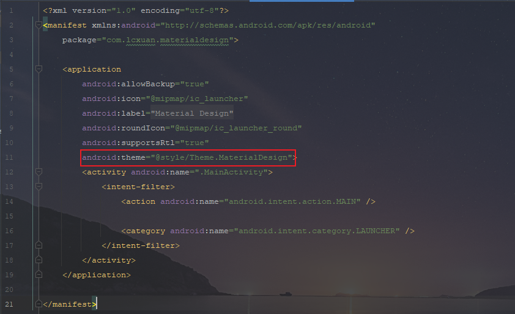
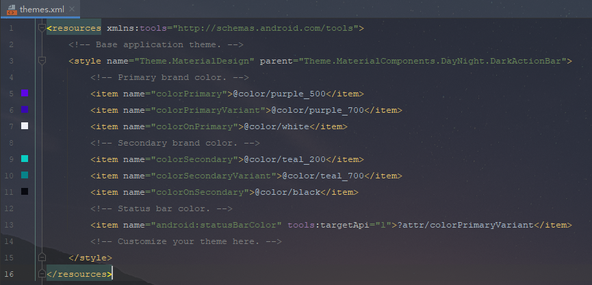
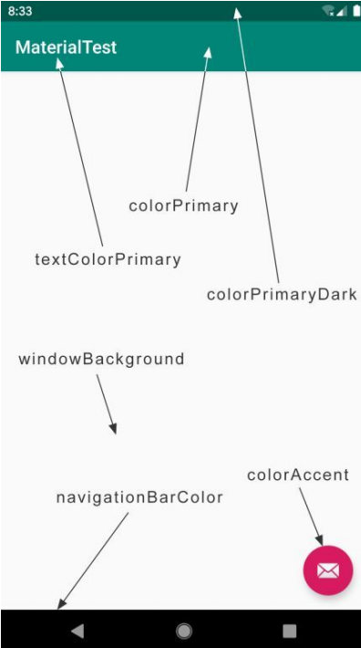

## ToolBar

ToolBar不仅继承了ActionBar的所有功能，并且灵活性极高，可以配合其他的控件完成一些Material Design的效果

首先要知道，任何一个新建的项目，默认都会显示ActionBar，这是因为根据项目中指定的主题来显示的。打开AndroidManifest.xml文件，会发现使用了android:theme属性指定一个Theme.MaterialDesign主题，如下图所示：



这里的主题定义在 res/values/themes.xml文件中，默认指定的主题为`Theme.MaterialComponents.DayNight.DarkActionBar`，我们创建的项目中就是因为指定了这个主题，所有会出现ActionBar，如下图所示：




现在我们准备使用ToolBar来替代ActionBar，因此我们需要使用一个不带ActionBar的主题，通常使用以下两个主题：

- Theme.AppCompat.NoActionBar：深色主题，它会将界面的主体颜色设成深色，陪衬颜色设成浅色
- Theme.AppCompat.Light.NoActionBar：浅色主题，它会将界面的主体颜色设成浅色，陪衬颜色设成深色【常用】

```xml
<resources xmlns:tools="http://schemas.android.com/tools">
    <!-- Base application theme. -->
    <style name="Theme.MaterialDesign" parent="Theme.AppCompat.Light.NoActionBar">
        <!-- Primary brand color. -->
        <item name="colorPrimary">@color/purple_500</item>
        <item name="colorPrimaryVariant">@color/purple_700</item>
        <item name="colorOnPrimary">@color/white</item>
        <!-- Secondary brand color. -->
        <item name="colorSecondary">@color/teal_200</item>
        <item name="colorSecondaryVariant">@color/teal_700</item>
        <item name="colorOnSecondary">@color/black</item>
        <!-- Status bar color. -->
        <item name="android:statusBarColor" tools:targetApi="l">?attr/colorPrimaryVariant</item>
        <!-- Customize your theme here. -->
    </style>
</resources>
```

观察以上代码，会发现重写了多个属性，这里的每个属性都对应每一个位置，使用下面的图片理解，



修改activity_main.xml中的代码，代码如下：

```xml
<?xml version="1.0" encoding="utf-8"?>
<LinearLayout xmlns:android="http://schemas.android.com/apk/res/android"
    xmlns:app="http://schemas.android.com/apk/res-auto"
    xmlns:tools="http://schemas.android.com/tools"
    android:layout_width="match_parent"
    android:layout_height="match_parent"
    tools:context=".MainActivity">

    <androidx.appcompat.widget.Toolbar
        android:id="@+id/toolbar"
        android:layout_width="match_parent"
        android:layout_height="?attr/actionBarSize"
        android:background="@color/purple_500"
        android:theme="@style/ThemeOverlay.AppCompat.Dark.ActionBar"
        app:popupTheme="@style/ThemeOverlay.AppCompat.Light"/>

</LinearLayout>
```

由于我们刚才在styles.xml中将程序的主题指定成了浅色主题，因此Toolbar现在也是浅色主题，那么Toolbar上面的各种元素就会自动使用深色系，从而和主体颜色区别开

为了能让Toolbar单独使用深色主题，这里我们使用了**android:theme**属性，将Toolbar的主题指定成了**ThemeOverlay.AppCompat.Dark.ActionBar**

但是指定后又会出现新的问题，如果ToolBar中有菜单按钮，那么弹出的菜单项会出现新的问题，这样就会出现新的问题，于是这里又使用了**app:popupTheme**属性，单独将弹出的菜单项指定成浅色主题

接着修改MainActivity的代码，使用**setSupportActionBar()**将ToolBar传入，代码如下：

```java
public class MainActivity extends AppCompatActivity {

    @Override
    protected void onCreate(Bundle savedInstanceState) {
        super.onCreate(savedInstanceState);
        setContentView(R.layout.activity_main);

        Toolbar toolbar = findViewById(R.id.toolbar);
        setSupportActionBar(toolbar);
    }
}
```


### Toolbar常用功能

修改标题栏上显示的文字内容，这段文字是在AndroidManifest.xml文件中指定，通过**android:label属性**指定，代码如下：

```xml
<?xml version="1.0" encoding="utf-8"?>
<manifest xmlns:android="http://schemas.android.com/apk/res/android"
    package="com.lcxuan.materialdesign">

    <application
        android:allowBackup="true"
        android:icon="@mipmap/ic_launcher"
        android:label="@string/app_name"
        android:roundIcon="@mipmap/ic_launcher_round"
        android:supportsRtl="true"
        android:theme="@style/Theme.MaterialDesign">
        <activity
            android:name=".MainActivity"
            android:label="Hello">
            <intent-filter>
                <action android:name="android.intent.action.MAIN" />

                <category android:name="android.intent.category.LAUNCHER" />
            </intent-filter>
        </activity>
    </application>
    
</manifest>
```


接着将几张图片放入drawable目录下，并且在 app -> 右击res -> New -> Directory，创建一个menu文件夹，接着右击menu文件夹 -> New -> Menu Resource File，创建一个**toolbar.xml文件**，并编写如下代码：

```xml
<?xml version="1.0" encoding="utf-8"?>
<menu xmlns:android="http://schemas.android.com/apk/res/android"
    xmlns:app="http://schemas.android.com/apk/res-auto">

    <item
        android:id="@+id/backup"
        android:icon="@drawable/ic_backup"
        android:title="BackUp"
        app:showAsAction="always"/>

    <item
        android:id="@+id/delete"
        android:icon="@drawable/ic_delete"
        android:title="Delete"
        app:showAsAction="ifRoom"/>

    <item
        android:id="@+id/settings"
        android:icon="@drawable/ic_settings"
        android:title="Settings"
        app:showAsAction="never"/>

</menu>
```

可以看到，我们通过<item>标签创建一个action按钮

- android:id：用于指定按钮的id
- android:icon：用于指定按钮的图标
- android:title：用于指定按钮的文字
- app:showAsAction：指定按钮的显示位置
  - always：表示永远显示在ToolBar中，屏幕不够则不显示
  - ifRoom：表示屏幕控件足够的情况下显示在Toolbar中，不够就显示在菜单当中
  - never：表示永远显示在菜单当中

**注意：Toolbar中的action按钮只会显示图标，菜单中的action只会显示文字**


接着修改MainActivity的功能代码，重写两个方法：**onCreateOptionsMenu()**和**onOptionsItemSelected()**方法，代码如下：

```java
@Override
public boolean onCreateOptionsMenu(Menu menu) {
    //加载Menu文件
    getMenuInflater().inflate(R.menu.toolbar, menu);
    return true;
}

@Override
public boolean onOptionsItemSelected(@NonNull MenuItem item) {
    switch (item.getItemId()){
        case R.id.backup:
            Toast.makeText(this, "Click backup", Toast.LENGTH_SHORT).show();
            break;
        case R.id.delete:
            Toast.makeText(this, "Click delete", Toast.LENGTH_SHORT).show();
            break;
        case R.id.settings:
            Toast.makeText(this, "Click settings", Toast.LENGTH_SHORT).show();
            break;
    }
    return true;
}
```

