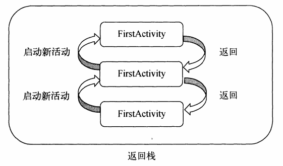
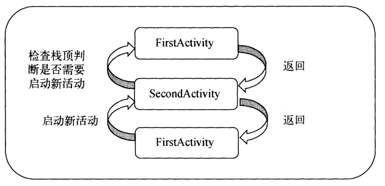
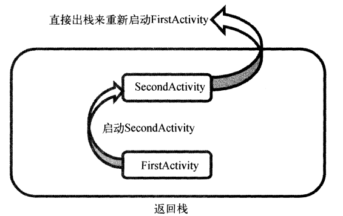
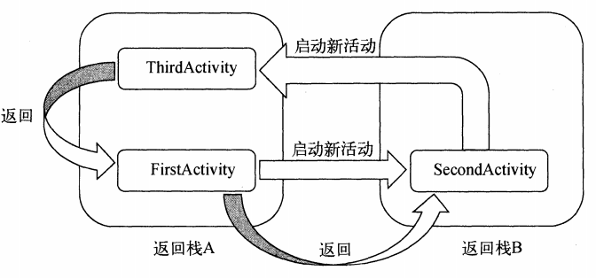

## Activity启动模式

Activity的启动模式一共有四种模式：

- standard【默认】
- singleTop
- singleTask
- singleInstance

我们可以通过在AndroidManifest.xml文件中通过给<activity>标签指定**android:lanuchMode**属性来选择启动模式

### standard

Activity默认的启动模式，由于Activity都是使用返回栈来管理Activity。

在standard模式下，每当启动一个新的Activity，就会在返回栈中入栈，并且处于栈顶的位置

系统不会在乎这个Activity是否已经处于返回栈中，每次启动都会创建一个新的Activity

**standard原理图：**

### singleTop

在启动启动时如果发现返回栈的栈顶已经是该活动，则认为可以直接使用它，不会再创建新的活动示例

但是如果该活动并未处于栈顶，这时再启动该活动，还是会创建一个新的活动示例

**singleTop原理图：**

### singleTask

每次启动该活动首先再返回栈中检查是否存在该活动的实例，如果发现已经存在则直接使用，并把这个活动之上的所有活动全部出栈

**singleTask原理图：**

### singleInstance

启动一个新的返回栈来管理该活动

例如：我们程序中有一个活动允许其他程序进行调用，这个使用前面三种模式是无法完成的，因为每个程序都有自己的返回栈，同一个活动在不同的返回栈中入栈必定会创建一个新的实例

这时使用singleInstance这个模式，会有一个单独的返回栈来管理这个活动，不管哪个应用程序来访问这个活动，都会共用同一个返回栈

**singleTask原理图：**

