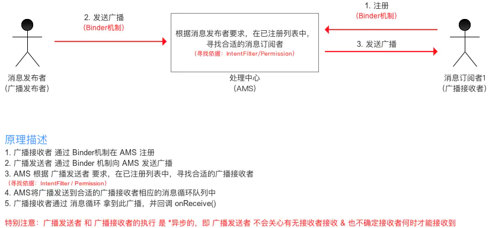

## BroadcastReceiver

### 介绍

广播，一个全局的监听器，属于Android四大组件之一

### 作用

监听 / 接收应用App发出的广播消息，并作出响应

### 应用场景

- Android不同组件之间的通信

- 多线程通信

- 与Android系统在特定情况下的通信

例如：电话呼入时，网络可用时

### 实现原理

使用了设计模式中的观察者模式：基于消息的发布 / 订阅事件模型

将广播的发送者和接收者解耦，使得系统方便继承，更易扩展

#### 三个角色

1. 消息订阅者（广播接收者）
2. 消息发布者（广播发布者）
3. 消息中心（AMS，即Activity Manager Service）



### 使用流程

#### 1、自定义广播接收者BroadcastReceiver

- 继承BroadcastReceiver基类
- 必须复写抽象方法onReceive()方法

> 1. 广播接收者接收到相应广播后，会自动回调onReceive()方法
> 2. 一般情况下，`onReceive()`方法会涉及与其他组件之间的交互，如：发送`Notification`、启动`Service`等
> 3. 默认情况下，广播接收器运行在`UI`线程，因此，`onReceive()`方法不能执行耗时操作，否则将导致ANR

- 代码示例：MyBroadcastReceiver.java

```java
public class MyBroadcastReceiver extends BroadcastReceiver {
    @Override
    public void onReceive(Context context, Intent intent) {
        //逻辑操作...
    }
}
```

#### 2、广播接收器注册

两种方式：静态注册、动态注册

##### 2.1、静态注册

注册方式：在AndroidManifest.xml里面通过<receiver></receiver>标签声明

- 示例代码

```xml
<receiver android:name="com.ttit.core.broadcastreceiver.MyBreceiver">
    <intent-filter>
        <action android:name"com.example.broadcasttest.MY_BROADCAST" />
    </intent-filter>
</receiver>
```

##### 2.2、动态注册

注册方式：在代码中调用`registerReceiver()`方法

- 示例代码

```java
public class BroadcastReceiverActivity extends AppCompatActivity {

    MyBroadcastReceiver myBroadcastReceiver;

    @Override
    protected void onCreate(Bundle savedInstanceState) {
        super.onCreate(savedInstanceState);
        setContentView(R.layout.activity_broadcast_receiver);

        //1. 实例化BroadcastReceiver子类 和 IntentFilter
        myBroadcastReceiver = new MyBroadcastReceiver();
        IntentFilter intentFilter = new IntentFilter();

        //2. 设置广播类型
        intentFilter.addAction("android.intent.action.AIRPLANE_MODE");

        //3. 动态注册，调用registerReceiver()
        registerReceiver(myBroadcastReceiver, intentFilter);
    }

    @Override
    protected void onDestroy() {
        super.onDestroy();
        //销毁广播
        unregisterReceiver(myBroadcastReceiver);
    }
}
```

### 广播发送者向AMS发送广播

#### 1、广播类型

- 普通广播
- 系统广播
- 有序广播
- 粘性广播
- APP应用内广播

#### 2、普通广播

即开发者自定义的广播【常用】

- 代码示例

```java
Intent intent = new Intent();
//对应广播的Action
intent.setAction("MY_ACTION");
//发送广播
sendBroadcast(intent);
```

#### 3、系统广播

- Android中内置了多个系统广播：只要涉及到手机的基本操作（如开机、网络状态变化、拍照等等），都会发出相应的广播
- 每个广播都有特定的Intent - Filter（包括具体的action）
- 当使用系统广播时，只需要在注册广播接收者时定义相关的action即可，并不需要手动发送广播，当系统有相关操作时会自动进行系统广播

| 系统操作                                       | Action                               |
| ------------------------------------------ | ------------------------------------ |
| 监听网络状态                                     | android.net.conn.CONNECTIVITY_CHANGE |
| 关闭或打开飞行模式                                  | Intent.ACTION_AIRPLANE_MODE_CHANGED  |
| 充电时或电量发生变化                                 | Intent.ACTION_BATTERY_CHANGED        |
| 电池电量低                                      | Intent.ACTION_BATTERY_LOW            |
| 电池电量充足（即从电量低变化到饱满时会发出广播                    | Intent.ACTION_BATTERY_OKAY           |
| 系统启动完成后(仅广播一次)                             | Intent.ACTION_BOOT_COMPLETED         |
| 按下照相时的拍照按键(硬件按键)时                          | Intent.ACTION_CAMERA_BUTTON          |
| 屏幕锁屏                                       | Intent.ACTION_CLOSE_SYSTEM_DIALOGS   |
| 设备当前设置被改变时(界面语言、设备方向等)                     | Intent.ACTION_CONFIGURATION_CHANGED  |
| 插入耳机时                                      | Intent.ACTION_HEADSET_PLUG           |
| 未正确移除SD卡但已取出来时(正确移除方法:设置--SD卡和设备内存--卸载SD卡) | Intent.ACTION_MEDIA_BAD_REMOVAL      |
| 插入外部储存装置（如SD卡）                             | Intent.ACTION_MEDIA_CHECKING         |
| 成功安装APK                                    | Intent.ACTION_PACKAGE_ADDED          |
| 成功删除APK                                    | Intent.ACTION_PACKAGE_REMOVED        |
| 重启设备                                       | Intent.ACTION_REBOOT                 |
| 屏幕被关闭                                      | Intent.ACTION_SCREEN_OFF             |
| 屏幕被打开                                      | Intent.ACTION_SCREEN_ON              |
| 关闭系统时                                      | Intent.ACTION_SHUTDOWN               |
| 重启设备                                       | Intent.ACTION_REBOOT                 |

#### 4、有序广播

- 发送出去的广播被广播接收者按照先后有序接收
- 优先级高的广播接收器可以优先接收到这条广播，并可以在优先级较低的广播接收器之前截断停止发送这条广播
- 代码示例

```java
Intent intent = new Intent();
//对应广播的Action
intent.setAction("MY_ACTION");
//发送广播
sendOrderBroadcast(intent);
```

#### 5、粘性广播

由于在Android5.0 & API 21中已经失效，所以不建议使用

#### 6、APP应用内广播

Android内的广播可以直接跨APP直接通信（exported对于有intent-filter情况下默认值为true）

- 使用方法一：将全局广播设置成局部广播

> 注册广播时将exported属性设置为*false*，使得非本App内部发出的此广播不被接收；
> 
> 在广播发送和接收时，增设相应权限permission，用于权限验证；
> 
> 发送广播时指定该广播接收器所在的包名，此广播将只会发送到此包中的App内与之相匹配的有效广播接收器中。
> 
> 通过**intent.setPackage(packageName)**指定报名

- 使用方法二：通过**intent.setPackage(packageName)**指定报名

> 使用方式上与全局广播几乎相同，只是注册/取消注册广播接收器和发送广播时将参数的context变成了LocalBroadcastManager的单一实例
> 
> 注：对于LocalBroadcastManager方式发送的应用内广播，只能通过LocalBroadcastManager动态注册，不能静态注册

```java
//注册应用内广播接收器
//步骤1：实例化BroadcastReceiver子类 & IntentFilter mBroadcastReceiver 
mBroadcastReceiver = new mBroadcastReceiver(); 
IntentFilter intentFilter = new IntentFilter(); 

//步骤2：实例化LocalBroadcastManager的实例
localBroadcastManager = LocalBroadcastManager.getInstance(this);

//步骤3：设置接收广播的类型 
intentFilter.addAction(android.net.conn.CONNECTIVITY_CHANGE);

//步骤4：调用LocalBroadcastManager单一实例的registerReceiver（）方法进行动态注册 
localBroadcastManager.registerReceiver(mBroadcastReceiver, intentFilter);

//取消注册应用内广播接收器
localBroadcastManager.unregisterReceiver(mBroadcastReceiver);

//发送应用内广播
Intent intent = new Intent();
intent.setAction(BROADCAST_ACTION);
localBroadcastManager.sendBroadcast(intent);
```

### 自定义广播

广播分为两种：标准广播和有序广播

#### 标准广播

创建一个广播接收器：MyBroadcastReceiver，这里的MyBroadcastReceiver接收到自定义广播时，弹出“receiver in MyBroadcastReceiver”，代码如下：

```java
package com.lcxuan.testandroid;

public class MyBroadcastReceiver extends BroadcastReceiver{
    @Override
    public void onReceive(Context context, Intent intent) {
        Toast.makeText(context, "receiver in MyBroadcastReceiver", Toast.LENGTH_SHORT).show();
        Log.v("MYTEST", "receiver in MyBroadcastReceiver");
    }
}
```

接着在AndroidManifest.xml中对广播接收器进行修改，这里让MyBroadcastReceiver接收一条值为“com.lcxuan.testandroid.MY_BROADCAST”的广播，代码如下：

```xml
<?xml version="1.0" encoding="utf-8"?>
<manifest xmlns:android="http://schemas.android.com/apk/res/android"
    package="com.lcxuan.testandroid">

    <application
        android:allowBackup="true"
        android:icon="@mipmap/ic_launcher"
        android:label="@string/app_name"
        android:roundIcon="@mipmap/ic_launcher_round"
        android:supportsRtl="true"
        android:theme="@style/Theme.TestAndroid">
        <activity android:name=".TestBroadcastActivity">
            <intent-filter>
                <action android:name="android.intent.action.MAIN" />

                <category android:name="android.intent.category.LAUNCHER" />
            </intent-filter>
        </activity>

*******************以下这段为重点********************************
        <receiver
            android:name=".MyBroadcastReceiver"
            android:enabled="true"
            android:exported="true">
            <intent-filter>
                <action android:name="com.lcxuan.testandroid.MY_BROADCAST" />
            </intent-filter>
        </receiver>
*******************以上这段为重点********************************

        <activity android:name=".MainActivity" />
    </application>

</manifest>
```

接着在布局文件中修改，在布局文件中定义一个按钮，用于发送广播，代码如下：

```xml
<?xml version="1.0" encoding="utf-8"?>
<LinearLayout xmlns:android="http://schemas.android.com/apk/res/android"
    xmlns:app="http://schemas.android.com/apk/res-auto"
    xmlns:tools="http://schemas.android.com/tools"
    android:layout_width="match_parent"
    android:layout_height="match_parent"
    tools:context=".TestBroadcastActivity">

    <Button
        android:id="@+id/btn"
        android:layout_width="wrap_content"
        android:layout_height="wrap_content"
        android:text="Send Broadcast"/>

</LinearLayout>
```

修改功能实现文件代码，首先需要构建一个Intent对象，将要发送的广播传入，如果是Android8以上或者更高版本需要设置包名，否则不是必须，然后调用Context的sendBroadcast()方法将广播发送出去，这样所有监听“com.lcxuan.testandroid.MY_BROADCAST”这条广播的广播接收者都会收到消息，代码如下：

```java
package com.lcxuan.testandroid;

public class TestBroadcastActivity extends AppCompatActivity {

    @Override
    protected void onCreate(Bundle savedInstanceState) {
        super.onCreate(savedInstanceState);
        setContentView(R.layout.activity_test_broadcast);

        Button btn = findViewById(R.id.btn);
        btn.setOnClickListener(new View.OnClickListener() {
            @Override
            public void onClick(View v) {
                Intent intent = new Intent("com.lcxuan.testandroid.MY_BROADCAST");
                intent.setPackage(getPackageName());
                sendBroadcast(intent);
            }
        });
    }
}
```

此时发送出去的广播就是一条标准广播

#### 有序广播

创建一个广播接收器：AnotherBroadcastReceiver，这里的AnotherBroadcastReceiver接收到自定义广播时，弹出“receiver in AnotherBroadcastReceiver”，代码如下：

```java
package com.lcxuan.testandroid;

public class AnotherBroadcastReceiver extends BroadcastReceiver {

    @Override
    public void onReceive(Context context, Intent intent) {
        Toast.makeText(context, "receiver in AnotherBroadcastReceiver", Toast.LENGTH_SHORT).show();
    }
}
```

接着在AndroidManifest.xml中对广播接收器进行修改，这里让AnotherBroadcastReceiver接收一条值为“com.lcxuan.testandroid.MY_BROADCAST”的广播，代码如下：

```xml
<?xml version="1.0" encoding="utf-8"?>
<manifest xmlns:android="http://schemas.android.com/apk/res/android"
    package="com.lcxuan.testandroid">

    <application
        android:allowBackup="true"
        android:icon="@mipmap/ic_launcher"
        android:label="@string/app_name"
        android:roundIcon="@mipmap/ic_launcher_round"
        android:supportsRtl="true"
        android:theme="@style/Theme.TestAndroid">
        <activity android:name=".Test2BroadcastActivity">

            <intent-filter>
                <action android:name="android.intent.action.MAIN" />

                <category android:name="android.intent.category.LAUNCHER" />
            </intent-filter>
        </activity>

*******************以下这段为重点********************************
        <receiver
            android:name=".AnotherBroadcastReceiver"
            android:enabled="true"
            android:exported="true">

            <intent-filter >
                <action android:name="com.lcxuan.testandroid.MY_BROADCAST" />
            </intent-filter>

        </receiver>
*******************以上这段为重点********************************

        <activity android:name=".MainActivity" />
    </application>

</manifest>
```

可以看到AnotherBroadcastReceiver依然是接收“com.lcxuan.testandroid.MY_BROADCAST”的广播，将程序安装到模拟器上，点击按钮，会发现分别弹出两次提示信息，这就说明了我们发出的广播是可以被其他程序接收到的，接着实现点击按钮发送有序广播

```java
package com.lcxuan.testandroid;

public class Test2BroadcastActivity extends AppCompatActivity {

    @Override
    protected void onCreate(Bundle savedInstanceState) {
        super.onCreate(savedInstanceState);
        setContentView(R.layout.activity_test2_broadcast);

        Button btn = findViewById(R.id.btn);

        btn.setOnClickListener(new View.OnClickListener() {
            @Override
            public void onClick(View v) {
                Intent intent = new Intent("com.lcxuan.testandroid.MY_BROADCAST");
                intent.setPackage(getPackageName());
                sendOrderedBroadcast(intent, null);
            }
        });
    }
}
```

这里看上去和标准广播没什么区别嘛，但是别忘了，这个时候的广播接收器是有先后顺序的，而且处于前面的广播接收器可以将广播截断，阻止继续传播

设置广播接收器先后顺序，可以通过android:priority属性给广播接收器设置优先级，优先级高的广播接收器可以先收到广播，代码如下：

```xml
<?xml version="1.0" encoding="utf-8"?>
<manifest xmlns:android="http://schemas.android.com/apk/res/android"
    package="com.lcxuan.testandroid">

    <application
        android:allowBackup="true"
        android:icon="@mipmap/ic_launcher"
        android:label="@string/app_name"
        android:roundIcon="@mipmap/ic_launcher_round"
        android:supportsRtl="true"
        android:theme="@style/Theme.TestAndroid">
        <activity android:name=".Test2BroadcastActivity">

            <intent-filter>
                <action android:name="android.intent.action.MAIN" />

                <category android:name="android.intent.category.LAUNCHER" />
            </intent-filter>
        </activity>

*******************以下这段为重点********************************
        <receiver
            android:name=".MyBroadcastReceiver"
            android:enabled="true"
            android:exported="true">
            <intent-filter android:priority="100">
                <action android:name="com.lcxuan.testandroid.MY_BROADCAST" />
            </intent-filter>
        </receiver>

        <receiver
            android:name=".AnotherBroadcastReceiver"
            android:enabled="true"
            android:exported="true">

            <intent-filter >
                <action android:name="com.lcxuan.testandroid.MY_BROADCAST" />
            </intent-filter>

        </receiver>
*******************以上这段为重点********************************

        <activity android:name=".MainActivity" />
    </application>

</manifest>
```

这里将MyBroadcastReceiver的优先级设置成100，保证它会在AnotherBroadcastReceiver前接收

既然已经获得了接收广播的优先权，那么MyBroadcastReceiver可以选择是否允许广播接收器继续传递，修改MyBroadcastReceiver中的代码，代码如下：

```java
package com.lcxuan.testandroid;

public class MyBroadcastReceiver extends BroadcastReceiver{
    @Override
    public void onReceive(Context context, Intent intent) {
        Toast.makeText(context, "receiver in MyBroadcastReceiver", Toast.LENGTH_SHORT).show();
        Log.v("MYTEST", "receiver in MyBroadcastReceiver");

        //将广播截断
        abortBroadcast();
    }
}
```

如果在onReceive()方法中调用abortBroadcast()，就表示将这条广播截断，后面的广播接收器将无法接收这条广播

现在重新运行程序，会发现只有MyBroadcastReceiver中的Toast能够弹出

### 参考文章

[Carson带你学Android：BroadcastReceiver史上最全面解析 - 简书 (jianshu.com)](https://www.jianshu.com/p/ca3d87a4cdf3)
