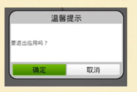
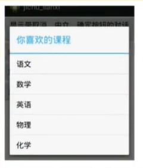
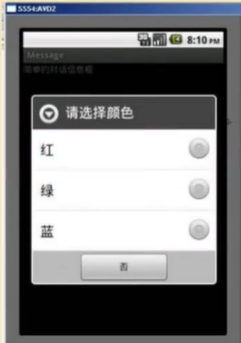

## 对话框

### 提示消息对话框

使用AlertDialog.Builder，可以创建各种功能和风格的对话框，该类型对话框可以只是显示对话框消息，也可以为按钮注册监听器实现对应的功能



```java
AlertDialog.Builder builder = new AlertDialog.Builder(AlertDialogActivity.this);
//设置标题
builder.setTitle("设置的标题");
//设置内容
builder.setMessage("设置的内容");
//设置按钮
builder.setPositiveButton("确定", new DialogInterface.OnClickListener() {
    @Override
    public void onClick(DialogInterface dialog, int which) {

    }
});
builder.setNegativeButton("取消", new DialogInterface.OnClickListener() {
    @Override
    public void onClick(DialogInterface dialog, int which) {

    }
});

//创建并显示
builder.create().show();
```

### 简单列表项对话框



AlertDialog.Builder中调用setItems()方法即可设置简单列表对话框

需要注意：调用时需要传入一个数组或数组资源的ID，其中参数**which**为选择哪一项编号

**注意：如果要设置列表项，就不可以在设置.setMessage()**

```java
AlertDialog.Builder builder = new AlertDialog.Builder(AlertDialogActivity.this);
//设置标题
builder.setTitle("设置的标题");

//设置列表
//1. 设置需要显示的列表数组
list = new String[]{
    "大数据", "云计算", "人工智能", "网站设计"
};
//2. 设置列表
builder.setItems(list, new DialogInterface.OnClickListener() {
    @Override
    public void onClick(DialogInterface dialog, int which) {
        Toast.makeText(getApplicationContext(), "当前选择：" + list[which], Toast.LENGTH_SHORT).show();
    }
});


//创建并显示
builder.create().show();
```

### 单选列表项



AlertDialog.Builder中调用setSingleChoiceItems()方法即可设置单选列表项

**注意：如果要设置列表项，就不可以在设置.setMessage()**

```java
AlertDialog.Builder builder = new AlertDialog.Builder(AlertDialogActivity.this);
//设置标题
builder.setTitle("设置的标题");

//设置单选列表项
//1. 设置需要显示的列表数组
list = new String[]{
    "大数据", "云计算", "人工智能", "网站设计"
};
//2. 设置单选列表
builder.setSingleChoiceItems(list, 0, new DialogInterface.OnClickListener() {
    @Override
    public void onClick(DialogInterface dialog, int which) {
        content = list[which];

    }
});

//设置按钮
builder.setPositiveButton("确定", new DialogInterface.OnClickListener() {
    @Override
    public void onClick(DialogInterface dialog, int which) {
        Toast.makeText(getApplicationContext(), "当前选择：" + content, Toast.LENGTH_SHORT).show();
    }
});

//创建并显示
builder.create().show();
```

### 多项列表项

AlertDialog.Builder中调用setMultiChoiceItems()方法即可设置多选列表项

**注意：如果要设置列表项，就不可以在设置.setMessage()**

```java
AlertDialog.Builder builder = new AlertDialog.Builder(AlertDialogActivity.this);
//设置标题
builder.setTitle("设置的标题");

//设置多选列表
//1. 设置需要显示的列表数组
list = new String[]{
    "大数据", "云计算", "人工智能", "网站设计"
};
//2. 设置默认选择项
flag = new boolean[]{
    true, false, false, false
};
//3. 设置多选列表
builder.setMultiChoiceItems(list, flag, new DialogInterface.OnMultiChoiceClickListener() {
    @Override
    public void onClick(DialogInterface dialog, int which, boolean isChecked) {
        //设置选项数组中的布尔值
        flag[which] = isChecked;
    }
});

//创建按钮
builder.setPositiveButton("确定", new DialogInterface.OnClickListener() {
    @Override
    public void onClick(DialogInterface dialog, int which) {
        content = "";
        for (int i = 0; i < flag.length; i++) {
            if (flag[i]){
                content += list[i] + "";
            }
        }
        Toast.makeText(getApplicationContext(), "当前选中：" + content, Toast.LENGTH_SHORT).show();
    }
});

//创建并显示
builder.create().show();
```

### 自定义对话框

AlertDialog.Builder提供了一个setAdapter()方法设置对话框内容

该方法需要传入一个Adapter参数
