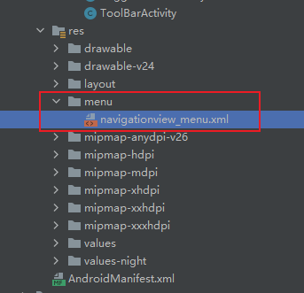

## 导航抽屉-NavigationView

所有控件布局放入 **DrawerLayout布局**中

```xml
<com.google.android.material.navigation.NavigationView
   	android:id="@+id/navigationView"
	android:layout_width="300dp"
	android:layout_height="match_parent"
	app:headerLayout="@layout/navigationview_header"	//设置NavigationView的头部
	android:layout_gravity="left"			//设置left：左侧滑 rigiht：右侧滑
	app:menu="@menu/navigationview_menu"/>	//设置NavigationView的菜单
```


### 设置菜单布局

1、在menu目录下创建xml文件



2、设置菜单

```xml
<?xml version="1.0" encoding="utf-8"?>
<menu xmlns:android="http://schemas.android.com/apk/res/android">
    <group>
        <item
            android:id="@+id/individualitySignature"
            android:icon="@drawable/navigationview_header_image"
            android:title="个性签名" />

        <item
            android:id="@+id/wallet"
            android:icon="@drawable/navigationview_header_image"
            android:title="钱包" />

        <item
            android:id="@+id/myFavorite"
            android:icon="@drawable/navigationview_header_image"
            android:title="我的收藏" />

        <item
            android:id="@+id/myPhotoAlbum"
            android:icon="@drawable/navigationview_header_image"
            android:title="我的相册" />

        <item
            android:id="@+id/myFile"
            android:icon="@drawable/navigationview_header_image"
            android:title="我的文件" />
    </group>
</menu>
```


### 设置图标可视化

```java
//设置图标可视化
navigationView.setItemIconTintList(null);
```


### 获取头部元素

```java
NavigationView navigationView = findViewById(R.id.navigationView);

//获取头部元素
View view = navigationView.getHeaderView(0);
view.findViewById(R.id.photo).setOnClickListener(new View.OnClickListener() {
    @Override
    public void onClick(View v) {
        //事件...
    }
});
```


### 设置列表项的点击事件

```java
//设置列表项的事件
navigationView.setNavigationItemSelectedListener(new NavigationView.OnNavigationItemSelectedListener() {
    @Override
    public boolean onNavigationItemSelected(@NonNull @NotNull MenuItem item) {
        //逻辑代码...

        return false;
    }
});
```

