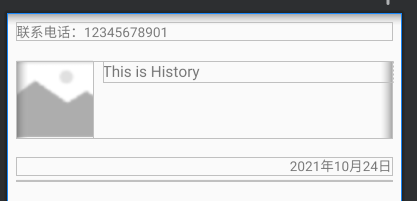

## 实现步骤

1. 初始化RecyclerView控件
2. 设置布局管理器
3. 整理显示的数据
4. 自定义item布局
5. 实现适配器
6. 设置适配器


### 初始化控件

```java
history_list = findViewById(R.id.history_list);
```


### 设置布局管理器

```java
//设置布局管理器
LinearLayoutManager linearLayoutManager = new LinearLayoutManager(this, LinearLayoutManager.VERTICAL, false);
history_list.setLayoutManager(linearLayoutManager);
```


### 整理显示的数据

```java
int[] ints = new int[10];
for (int i = 0; i < ints.length; i++) {
    ints[i] = R.drawable.history_img;
}

List<Map<String, Object>> list = new ArrayList<>();
for (int i = 0; i < ints.length; i++) {
    HashMap<String, Object> map = new HashMap<>();
    map.put("text", "This is Historyasdsajdklasjldkjasldkjaslkjdskla" + i);
    map.put("phone", "1307863715" + i);
    map.put("date", "2021年11月" + i + "日");
    map.put("image", ints[i]);
    list.add(map);
}
```


### 自定义item布局

```java
<?xml version="1.0" encoding="utf-8"?>
<LinearLayout xmlns:android="http://schemas.android.com/apk/res/android"
    android:layout_width="match_parent"
    android:layout_height="match_parent"
    android:padding="10dp"
    android:orientation="vertical"
    android:layout_gravity="center_horizontal">

    <TextView
        android:id="@+id/history_phone"
        android:layout_width="match_parent"
        android:layout_height="wrap_content"
        android:text="联系电话：12345678901"/>

    <LinearLayout
        android:layout_width="match_parent"
        android:layout_height="wrap_content"
        android:orientation="horizontal"
        android:layout_marginTop="20dp"
        android:layout_marginBottom="20dp">

        <ImageView
            android:id="@+id/history_image"
            android:layout_width="80dp"
            android:layout_height="80dp"
            android:scaleType="centerCrop"
            android:src="@drawable/history_img"/>

        <TextView
            android:id="@+id/history_text"
            android:layout_width="match_parent"
            android:layout_height="wrap_content"
            android:textSize="16sp"
            android:layout_marginLeft="10dp"
            android:text="This is History"/>

    </LinearLayout>

    <TextView
        android:id="@+id/history_date"
        android:layout_width="match_parent"
        android:layout_height="wrap_content"
        android:text="2021年10月24日"
        android:gravity="right"/>

    <LinearLayout
        android:layout_width="match_parent"
        android:layout_height="1dp"
        android:background="#ccc"
        android:layout_marginTop="5dp"/>

</LinearLayout>
```




### 实现适配器

```java
class Adapter extends RecyclerView.Adapter{
    List<Map<String, Object>> list;
    public Adapter(List<Map<String, Object>> list){
        this.list = list;
    }

    @NonNull
    @NotNull
    @Override
    public RecyclerView.ViewHolder onCreateViewHolder(@NonNull @NotNull ViewGroup parent, int viewType) {
        View view = LayoutInflater.from(getApplicationContext()).inflate(R.layout.history_feedback_item, null);
        Holder holder = new Holder(view);
        return holder;
    }

    @Override
    public void onBindViewHolder(@NonNull @NotNull RecyclerView.ViewHolder holder, int position) {
        Map<String, Object> data = list.get(position);

        ((Holder) holder).history_text.setText((String)data.get("text"));

        String phone = (String) data.get("phone");
        ((Holder) holder).history_phone.setText("联系方式：" + phone);
        ((Holder) holder).history_date.setText((String) data.get("date"));
        ((Holder) holder).history_image.setImageResource((int)data.get("image"));
    }

    @Override
    public int getItemCount() {
        return list.size();
    }

    class Holder extends RecyclerView.ViewHolder{
        TextView history_phone,history_text , history_date;
        ImageView history_image;
        public Holder(@NonNull @NotNull View itemView) {
            super(itemView);

            history_phone = (TextView) itemView.findViewById(R.id.history_phone);
            history_text = (TextView) itemView.findViewById(R.id.history_text);
            history_date = (TextView) itemView.findViewById(R.id.history_date);
            history_image = (ImageView) itemView.findViewById(R.id.history_image);
        }
    }
}
```


### 设置适配器

```java
//设置适配器
history_list.setAdapter(new Adapter(list));
```

