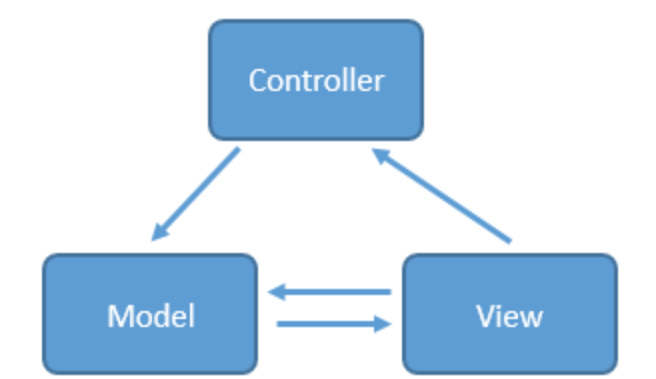
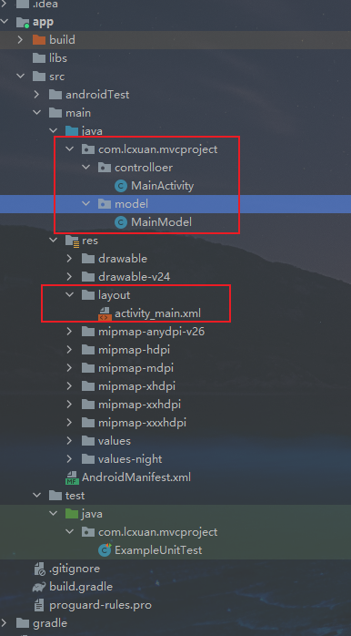

## MVC模型

MVC全名Model View Controller，模型（Model） - 视图（View）- 控制器（Controller），是一种框架模式

> Model：模型层，用于负责处理数据的加载或存储
>
> View：视图层，用于负责界面数据的展示，和用户进行交互
>
> Controller：控制器层，用于负责逻辑业务的处理

优点：一定程度上实现了Model与View的分离，降低了代码的耦合性

缺点：


### 需求

点击一个按钮对数字进行 +1然后重新显示出来


### 实现



创建一个项目，新建两个包



布局实现：

```xml
<?xml version="1.0" encoding="utf-8"?>
<LinearLayout xmlns:android="http://schemas.android.com/apk/res/android"
    xmlns:app="http://schemas.android.com/apk/res-auto"
    xmlns:tools="http://schemas.android.com/tools"
    android:layout_width="match_parent"
    android:layout_height="match_parent"
    android:orientation="vertical"
    android:gravity="center_horizontal"
    tools:context=".MainActivity">

    <ImageView
        android:layout_width="wrap_content"
        android:layout_height="wrap_content"
        android:layout_marginBottom="40dp"
        android:layout_marginTop="40dp"
        android:src="@mipmap/ic_launcher_round"/>

    <EditText
        android:id="@+id/et_phone_number"
        android:layout_width="match_parent"
        android:layout_height="wrap_content"
        android:layout_marginLeft="40dp"
        android:layout_marginRight="40dp"
        android:hint="请输入手机号"
        android:inputType="number"
        android:textColor="#333"
        android:textSize="14sp"/>

    <EditText
        android:id="@+id/et_password"
        android:layout_width="match_parent"
        android:layout_height="wrap_content"
        android:layout_marginLeft="40dp"
        android:layout_marginRight="40dp"
        android:layout_marginTop="20dp"
        android:hint="请输入密码"
        android:inputType="textPassword"
        android:textColor="#333"
        android:textSize="14sp"/>

    <Button
        android:id="@+id/btn_login"
        android:layout_width="match_parent"
        android:layout_height="wrap_content"
        android:layout_marginLeft="40dp"
        android:layout_marginRight="40dp"
        android:layout_marginTop="20dp"
        android:text="登陆"
        android:textColor="#fff"
        android:textSize="20sp"/>

    <ProgressBar
        android:id="@+id/progressbar"
        android:layout_width="wrap_content"
        android:layout_height="wrap_content"
        android:layout_centerInParent="true"
        android:visibility="gone"/>

</LinearLayout>
```

模型实现：

```java
public class LoginModel {
    private static final String TAG = "LCXUANTEST";

    public void login(String phoneNumber, String password, OnResponseListener listener){
        if (phoneNumber.equals("13078637156") && password.equals("123456")){

            User user = new User();
            user.setId(1);
            user.setName("Lcxuan");
            user.setAge(18);

            listener.onSuccess(user);
        }else {
            listener.onError("登陆失败");
        }
    }

    public interface OnResponseListener{
        void onSuccess(User user);

        void onError(String msg);
    }
}
```

控制器实现：

```java
public class MainActivity extends AppCompatActivity implements View.OnClickListener {

    private static final String TAG = "LCXUANTEST";

    private EditText etPhoneNumber;
    private EditText etPassword;
    private Button btnLogin;
    private ProgressBar progressBar;

    @Override
    protected void onCreate(Bundle savedInstanceState) {
        super.onCreate(savedInstanceState);
        setContentView(R.layout.activity_main);

        initView();
    }

    private void initView(){
        etPassword = findViewById(R.id.et_password);
        etPhoneNumber = findViewById(R.id.et_phone_number);
        btnLogin = findViewById(R.id.btn_login);
        progressBar = findViewById(R.id.progressbar);

        btnLogin.setOnClickListener(this);
    }

    @Override
    public void onClick(View view) {
        switch (view.getId()){
            case R.id.btn_login:
                String phoneNumber = etPhoneNumber.getText().toString().trim();
                String password = etPassword.getText().toString().trim();
                login(phoneNumber, password);
                break;
            default:
                break;
        }
    }

    private void login(String phoneNumber, String password){
        boolean isValidate = validateInput(phoneNumber, password);
        if (isValidate){
            progressBar.setVisibility(View.VISIBLE);

            LoginModel loginModel = new LoginModel();
            loginModel.login(phoneNumber, password, new LoginModel.OnResponseListener() {
                @Override
                public void onSuccess(User user) {
                    progressBar.setVisibility(View.GONE);
                    Log.e(TAG, "id: " + user.getId());
                    Log.e(TAG, "name: " + user.getName());
                    Log.e(TAG, "age: " + user.getAge());
                }

                @Override
                public void onError(String msg) {
                    progressBar.setVisibility(View.GONE);
                    Log.e(TAG, "onError: " + msg);
                }
            });
        }
    }

    private boolean validateInput(String phoneNumber, String password){
        if (isEmpty(phoneNumber)){
            Toast.makeText(this, "手机号码不能为空", Toast.LENGTH_SHORT).show();
            return false;
        }
        if (isEmpty(password)){
            Toast.makeText(this, "密码不能为空", Toast.LENGTH_SHORT).show();
            return false;
        }
        return true;
    }

    private boolean isEmpty(String value){
        if (value == null || value.equals("")){
            return true;
        }
        return false;
    }
}
```

