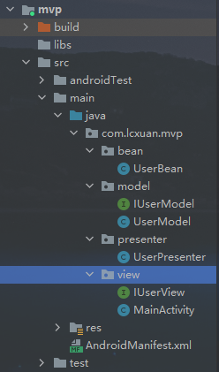

## MVP

MVP（Model View Presenter）：一种开发模式，为了解决MVC中View层和Model层之间的强耦合，Controller是基于行为的并被多个View共享，从而演变MVP

### MVP各层的职责

- View：负责绘制UI元素，与用户进行交互

- Model：负责存储、检索、操纵数据
- Presenter：作为View和Model交互的中间纽带，处理两者之间的业务逻辑


### MVC和MVP的区别

MVC：

- View可以直接与Model交互
- Controller是基于行为的，并且可以被多个View共享
- 可以负责决定显示哪个View

MVP：

- View不直接与Model交互，而是通过Presenter来与Model交互
- Presenter与View的交互通过接口来进行，有利于单元测试
- 通过View和Presenter是一对一的，但是复杂的View可能会绑定多个Presenter来处理不同的业务逻辑


### 主要目录结构



### 代码实现

首先创建一个UserBean，用于保存用户的数据，代码如下：

```java
public class UserBean {
    private int id;
    private String firstName;
    private String lastName;

    public int getId() {
        return id;
    }

    public void setId(int id) {
        this.id = id;
    }

    public String getFirstName() {
        return firstName;
    }

    public void setFirstName(String firstName) {
        this.firstName = firstName;
    }

    public String getLastName() {
        return lastName;
    }

    public void setLastName(String lastName) {
        this.lastName = lastName;
    }
}
```


#### Model

Model中主要有包含UserModel和接口IUserModel，并且UserModel实现接口IUserModel

在接口IUserModel中定义保存数据到Model以及从Model获取数据的方法

IUserModel接口，代码如下：

```java
public interface IUserModel {

    void setId(int id);
    void setFirstName(String firstName);
    void setLastName(String lastName);

    UserBean load(int id);
}
```

IUserModel接口实现，代码如下：

```java
public class UserModel implements IUserModel{

    private UserBean userBean = new UserBean();

    @Override
    public void setId(int id) {
        userBean.setId(id);
    }

    @Override
    public void setFirstName(String firstName) {
        userBean.setFirstName(firstName);
    }

    @Override
    public void setLastName(String lastName) {
        userBean.setLastName(lastName);
    }

    @Override
    public UserBean load(int id) {
        if (id == userBean.getId()){
            return userBean;
        }
        return null;
    }
}
```

#### View

View中主要包含MainActivity和接口IUserView，并且UserActivity实现接口IUserView

并且在UserActivity中包含一个Presenter的变量将自己和Presenter进行绑定

在IUserView中定义了可以从View中获取数据的方法以及View添加数据的方法

实现IUserView接口，代码如下：

```java
public interface IUserView {

    void setFirstName(String firstName);
    void setLastName(String lastName);

    public abstract int getId();
    String getFirstName();
    String getLastName();
}
```

IUserView实现类，代码如下：

```java
public class MainActivity extends AppCompatActivity implements IUserView, View.OnClickListener {

    private EditText id;
    private EditText firstname;
    private EditText lastname;
    private Button saveUser, loadUser;
    private UserPresenter userPresenter;


    @Override
    protected void onCreate(Bundle savedInstanceState) {
        super.onCreate(savedInstanceState);
        setContentView(R.layout.activity_main);

        initView();
    }

    private void initView(){
        id = findViewById(R.id.et_id);
        firstname = findViewById(R.id.et_firstname);
        lastname = findViewById(R.id.et_lastname);
        saveUser = findViewById(R.id.save_user);
        loadUser = findViewById(R.id.load_user);

        saveUser.setOnClickListener(this);
        loadUser.setOnClickListener(this);

        userPresenter = new UserPresenter(this);
    }

    @Override
    public void setFirstName(String firstName) {
        firstname.setText(firstName);
    }

    @Override
    public void setLastName(String lastName) {
        lastname.setText(lastName);
    }

    @Override
    public int getId() {
        return Integer.parseInt(id.getText().toString());
    }

    @Override
    public String getFirstName() {
        return firstname.getText().toString();
    }

    @Override
    public String getLastName() {
        return lastname.getText().toString();
    }

    @Override
    public void onClick(View view) {
        switch (view.getId()){
            case R.id.save_user:
                userPresenter.saveUser(getId(), getFirstName(), getLastName());
                break;
            case R.id.load_user:
                userPresenter.loadUser(getId());
                break;
        }
    }
}
```


#### Presenter

Presenter中持有与View交互接口IUserView以及与Model交互接口IUserModel，并使用构造函数与View进行绑定

在Presenter实现从Model中取数据并将数据显示到View，实现将View传来的数据保存到Model中

```java
public class UserPresenter {

    private IUserModel iUserModel;
    private IUserView iUserView;

    public UserPresenter(IUserView iUserView) {
        this.iUserView = iUserView;
        this.iUserModel = new UserModel();
    }

    public void saveUser(int id, String firstName, String lastName){
        iUserModel.setId(id);
        iUserModel.setFirstName(firstName);
        iUserModel.setLastName(lastName);
    }

    public void loadUser(int id){
        UserBean userBean = iUserModel.load(id);

        if (userBean != null){
            iUserView.setFirstName(userBean.getFirstName());
            iUserView.setLastName(userBean.getLastName());
        }
    }
}
```

