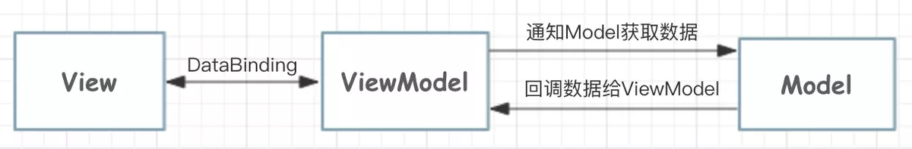
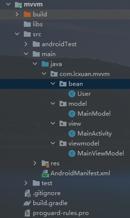

## MVVM

MVVM（Model-View-ViewModel），它将View的状态和行为完全抽象化，把逻辑与界面的控制完全交给ViewModel处理

三层：

- View：主要进行视图控件的一些初始设置，不应该有任何数据逻辑操作
- Model：定义实体类，以及获取业务数据模型，比如通过数据库或者网络来操作数据
- ViewModel：作为连接View与Model的中间桥梁，ViewModel与Model直接交互，处理完全业务逻辑后，通过DataBinding将数据变化反应到用户界面上

优点：

- **低耦合：**数据处理逻辑独立于UI层，ViewModel只负责提供数据和处理数据，不会持有View层的引用。View层只负责对数据变化的监听，不会处理任何跟数据相关的逻辑
- **数据驱动：**UI的展现是依赖于数据的，数据的变化会使UI发生变化，而UI的改变也会使数据Model进行对应的更新，ViewModel只需要处理数据，而View层只需要监听并使数据进行UI更新
- **异步线程更新Model：**Model数据可以在异步线程中发送变化，此时调用者不需要做额外的处理，数据绑定框架会将异步线程中数据的变化通知到UI线程中交给View更新
- **方便协作：**View层和逻辑层几乎没有耦合，在团队开发中，可以一个人负责UI，一个人负责数据处理。并行开发，保证开发的进度
- **易于单元测试：**ViewModel只负责数据处理，在单元测试时，不需要构建一个Fragment/Activity等进行数据的测试。同理View层也一样，只需要输入指定格式的数据即可进行测试，而且两者相互独立，不会互相影响
- **数据复用：**ViewModel对数据的获取和处理逻辑，是完全可以复用的，开发者可以在不同的模块中，多次方便的获取同一份来源的数据，同一份数据，在版本功能的迭代时，逻辑不需要改变，只需要改变View即可




### 实现步骤

1. 提供View、Model、ViewModel三层
2. 将布局修改成DataBinding布局
3.  通过DataBinding将View和ViewModel之间通信
4. 将数据展示到页面上


### 代码示例



#### 创建实体类

```java
public class User {
    private int id;
    private String name;
    private int age;

    public User() { }

    public int getId() {
        return id;
    }

    public void setId(int id) {
        this.id = id;
    }

    public String getName() {
        return name;
    }

    public void setName(String name) {
        this.name = name;
    }

    public int getAge() {
        return age;
    }

    public void setAge(int age) {
        this.age = age;
    }
}
```


#### 实现model

```java
//获取本地或者网络上的数据
public class MainModel {
    //这里模拟获取数据，将成功的数据返回到onSuccess()方法中，失败的信息返回到onFailure()方法中
    public void getAccountInfo(String userId, Callback callback){
        Random random = new Random();
        boolean isBoolean = random.nextBoolean();
        if (isBoolean){
            User user = new User();
            user.setId(1);
            user.setName("张三");
            user.setAge(18);
            callback.onSuccess(user);
        }else {
            callback.onFailure(userId);
        }
    }

    public interface Callback{
        void onSuccess(User user);
        void onFailure(String id);
    }
}
```


#### 布局实现

```xml
<?xml version="1.0" encoding="utf-8"?>
<layout xmlns:android="http://schemas.android.com/apk/res/android"
    xmlns:app="http://schemas.android.com/apk/res-auto"
    xmlns:tools="http://schemas.android.com/tools">

    <data>
        <variable
            name="viewModel"
            type="com.lcxuan.mvvm.viewmodel.MainViewModel" />
    </data>

    <LinearLayout
        android:layout_width="match_parent"
        android:layout_height="match_parent"
        tools:context=".MainActivity"
        android:orientation="vertical"
        android:gravity="center_horizontal">

        <EditText
            android:id="@+id/input"
            android:layout_width="match_parent"
            android:layout_height="wrap_content"
            android:hint="请输入账号" />

        <Button
            android:layout_width="match_parent"
            android:layout_height="wrap_content"
            android:text="查询账号信息"
            android:onClick="@{() -> viewModel.selectUserInfo()}"/>

        <TextView
            android:layout_width="wrap_content"
            android:layout_height="wrap_content"
            android:text="@={viewModel.result}"/>

    </LinearLayout>
</layout>
```


#### 布局绑定

```java
public class MainActivity extends AppCompatActivity {

    @Override
    protected void onCreate(Bundle savedInstanceState) {
        super.onCreate(savedInstanceState);
        ActivityMainBinding binding = DataBindingUtil.setContentView(this, R.layout.activity_main);
        binding.setViewModel(new MainViewModel(binding));
    }
}
```


#### ViewModel实现

```java
public class MainViewModel extends BaseObservable{

    private ActivityMainBinding binding;
    private MainModel mainModel = new MainModel();
    private String result;

    public MainViewModel(ActivityMainBinding binding) {
        this.binding = binding;
    }

    @Bindable
    public String getResult() {
        return result;
    }

    public void setResult(String result) {
        this.result = result;
        notifyPropertyChanged(BR.result);
    }

    public void selectUserInfo(){
        String inputId = binding.input.getText().toString();
        mainModel.getAccountInfo(inputId, new MainModel.Callback() {
            @Override
            public void onSuccess(User user) {
                setResult("查询到的结果为：用户id：" + user.getId() + ", 用户名：" + user.getName() + ", 年龄：" + user.getAge());
            }

            @Override
            public void onFailure(String id) {
                setResult("找不到用户id为" + id + "的数据");
            }
        });
    }
}
```

