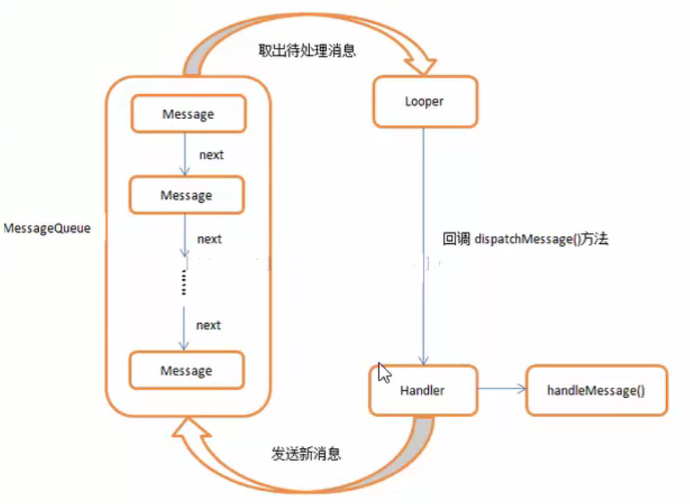

## 为什么线程与线程之间需要通讯

例如：我们实现了一个网络请求，获取到数据后需要刷新控件

但是Android规定了控件只能在主线程中操作

所以这里就需要用到子线程和主线程之间的通讯


## Handler

### Handler介绍

Handler在Android中负责发送和处理消息，通过它可以实现其他线程与Main线程之间的消息通讯

## Looper

### Looper介绍

Looper负责管理线程的消息队列和消息循环


## Message

### Message介绍

Message是线程间通讯的消息载体。例如：两个码头之间运输货物，Message就充当了集装箱的功能，里面可以存放任何想要传递的消息


## MessageQueue

### MessageQueue介绍

MessageQueue是消息队列，先进先出

作用是：保存有待线程处理的消息


## 四个的关系

在其他线程中调用Handler.sendMessage()方法，将需要Main线程处理的事件添加在Main线程中的MessageQueue中，Main线程通过MainLooper从消息队列中取出来的Handler发过来的消息，会回调Handler的handlerMessage()方法




## Handler的send用法

### 四种方法

1. sendEmptyMessage(int);
2. sendMessage(Message);
3. sendMessageAtTime(Message，long);
4. sendMessageDelayed(Message，long);


### sendEmptyMessage()

发送一个空的消息

```java
handler.sendEmptyMessage(1);
```


### sendMessage()

将一个带有数据的Message对象到队列中，等待处理

```java
Message message = new Message();
message.what = 1;
message.obj = "123";
handler.sendMessage(message);
```


### sendMessageAtTime()

在特定的时间消息队列

```java
Message message = new Message();
message.what = 1;
message.obj = "123";
handler.sendMessageAtTime(message, 1642852567);
```


#### sendMessageDelayed()

延时发送消息队列

```java
Message message = new Message();
message.what = 1;
message.obj = "123";
handler.sendMessageDelayed(message, 3000);
```


#### Handler处理消息

实现线程通信

```java
//消息处理: 实现线程中通信
handler = new Handler(Looper.getMainLooper()){
    @Override
    public void handleMessage(@NonNull Message msg) {
        super.handleMessage(msg);
        switch (msg.what){
            case 1:
                Toast.makeText(getApplicationContext(), "当前接收到：" + msg.obj, Toast.LENGTH_SHORT).show();
                break;
        }
    }
};

new Thread(){
    @Override
    public void run() {
        super.run();
        Message message = new Message();
        message.what = 1;	  //信息编号
        message.obj = "123";  //信息数据
        handler.sendMessage(message);
    }
}.start();
```


## Handler的post用法

### 三个方法

1. post(Runnable)
2. postAtTime(Runnable，long)
3. postDelayed(Runnable，long)

允许排列一个Runnable对象到主线程队列中，等待执行


### post()

在Runnable做的任务发送到主线程中

```java
handler.post(new Runnable() {
    @Override
    public void run() {
        Log.e("TAG", "run...");
    }
});
```


### postAtTime()

特定时间在主线程中执行Runnable中的任务

```java
handler.postAtTime(new Runnable() {
    @Override
    public void run() {
        Log.e("TAG", "run...");
    }
}, 1642852567);
```


### postDelayed()

延时在主线程中执行Runnable中的任务

```java
handler.postDelayed(new Runnable() {
    @Override
    public void run() {
        Log.e("TAG", "run...");
    }
}, 2000);
```


### Handler延时处理

使用postDelayed方法

参数一：线程对象

参数二：延时时间

```java
//延时操作
handler = new Handler();
handler.postDelayed(new Runnable() {
    @Override
    public void run() {
        Toast.makeText(getApplicationContext(), "三秒执行", Toast.LENGTH_SHORT).show();
    }
}, 3000);
```

