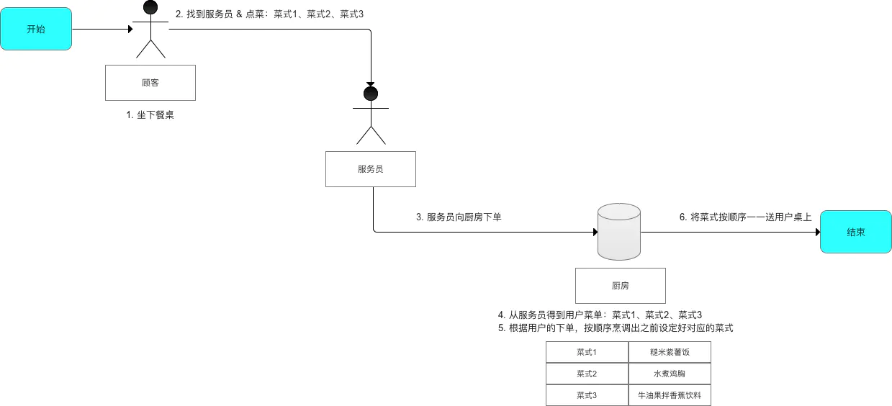
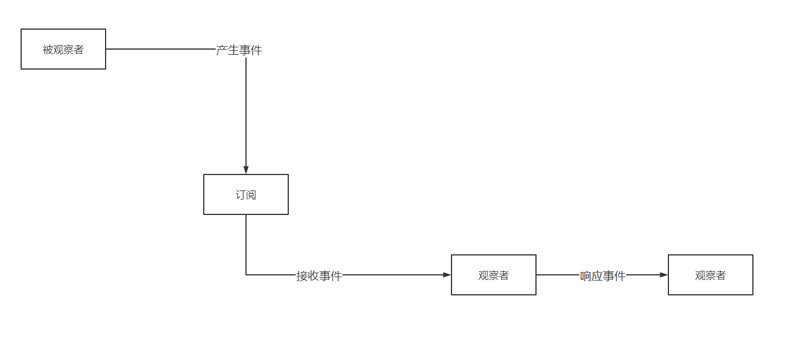
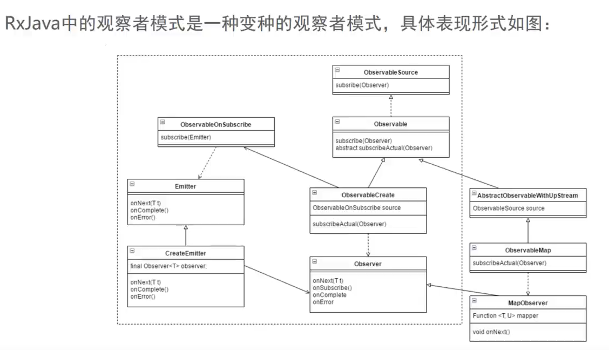

## RxJava

一个基于事件流、实现异步操作的库

主要用于实现异步操作

https://github.com/ReactiveX/RxJava

https://github.com/ReactiveX/RxAndroid

### 特点

由于实现的方式是基于事件流的链式调用

- 逻辑简洁
- 实现优雅
- 使用简单

可以将所有的事件（数据）看成一条河流，它可以被观察、过滤或者操作，也可以和另外一条河流合成一条新的河流。

### 适用场景

网路请求、数据库读写、文件读写、定时任务等各种耗时操作需要通过异步来完成的操作

### RxJava的原理

#### 1、生活例子引入



#### 2、原理介绍

一种扩展的观察者模式，有四个角色

| 角色   | 作用            | 类似  |
| ---- | ------------- | --- |
| 被观察者 | 产生事件          | 顾客  |
| 观察着  | 接收事件          | 厨房  |
| 订阅   | 连接被观察者和观察者    | 服务员 |
| 事件   | 被观察者和观察者沟通的载体 | 菜单  |



### 基本实现

#### 1、实现步骤

1. 创建被观察者产生事件【即顾客进入饭店 - 坐下 - 点菜】
2. 创建观察者响应事件【即厨房确定菜式】
3. 通过订阅连接被观察者和观察者【顾客找到服务员 - 点菜 - 服务员下单到厨房】

#### 2、步骤详细

##### 2.1、创建被观察者产生事件

```java
//1. 创建被观察者 Observable对象
Observable.create(new ObservableOnSubscribe<String>() {
    //create()是RxJava最基础的创建事件序列的方法
    //此处传入了一个OnSubscribe的对象参数
    //当Observable被订阅时，OnSubscribe的call()方法会自动被调用，即事件序列会依次执行

    //2. 在复写subscribe()方法中定义需要发送的事件
    @Override
    public void subscribe(@NonNull ObservableEmitter<String> emitter) throws Throwable {
        //通过ObservableEmitter产生事件并通知观察者
        emitter.onNext("test1");
        emitter.onNext("test2");
        emitter.onNext("test3");
        emitter.onComplete();
    }
});

----------- 扩展 -----------
//方法一：使用just()方法
//一次执行
//onNext("test1");
//onNext("test2");
//onNext("test3");
//onNext("test4");
//onComplete()
Observable.just("test1", "test2", "test3", "test4");
```

##### 2.2、创建观察者响应事件

onNext()：普通事件，向观察者发送需要响应事件的信号，**被观察者**可以发送无限个next事件，观察者可以接收无限个next事件

onCompleted()：事件队列完结事件，**标志着被观察者不再发送普通事件**，当被观察者发送Completed事件后，Completed事件后的事件继续发送，但观察者收到Completed事件后不再继续接收任何的事件，被观察者可以不发送Completed事件

onError()：事件队列异常事件，**标志事件处理过程中出现异常**，当被观察者发送Error事件后，Error事件后的的事件继续发送，但观察者收到Error事件后不再继续接收任何的事件，被观察者可以不发送Error事件

onCompleted()和onError()的使用规则：

- 两者时互斥的，只能发送其中的一个
- 两者都是唯一的，只能发送一个

方法一：采用Observer接口

```java
//1. 创建观察者 Observer对象
Observer<String> observer = new Observer<String>() {

    //观察者接收事件前，默认最先调用该复写
    @Override
    public void onSubscribe(@NonNull Disposable d) {

    }

    //当被观察者产生Next事件，观察者接收到时，会调用复写该方法
    @Override
    public void onNext(@NonNull String s) {

    }

    //当被观察者产生Error事件，观察者接收到时，会调用复写该方法
    @Override
    public void onError(@NonNull Throwable e) {

    }

    //当被观察者产生Complete事件，观察者接收到时，会调用复写该方法
    @Override
    public void onComplete() {

    }
};
```

方法二：采用Subscriber 抽象类

```java
//1. 创建观察者 Observer对象
Subscriber<String> subscriber = new Subscriber<String>() {
    //观察者接收事件前，默认最先调用该复写
    @Override
    public void onSubscribe(Subscription s) {

    }

    //当被观察者产生Next事件，观察者接收到时，会调用复写该方法
    @Override
    public void onNext(String s) {

    }

    //当被观察者产生Error事件，观察者接收到时，会调用复写该方法
    @Override
    public void onError(Throwable t) {

    }

    //当被观察者产生Complete事件，观察者接收到时，会调用复写该方法
    @Override
    public void onComplete() {

    }
};
```

##### 2.3、通过订阅连接被观察者和观察者

```java
observable.subscribe(observer);
```

#### 3、优雅的实现方法 - 基于事件流的链式调用

```java
Observable.create(new ObservableOnSubscribe<Integer>() {
    @Override
    public void subscribe(@NonNull ObservableEmitter<Integer> emitter) throws Throwable {
        emitter.onNext(1);
        emitter.onNext(2);
        emitter.onNext(3);
        emitter.onComplete();
    }
}).subscribe(new Observer<Integer>() {
    @Override
    public void onSubscribe(@NonNull Disposable d) {

    }

    @Override
    public void onNext(@NonNull Integer integer) {

    }

    @Override
    public void onError(@NonNull Throwable e) {

    }

    @Override
    public void onComplete() {

    }
});
```

#### 4、consumer的使用

```java
Observable.create(new ObservableOnSubscribe<Object>() {
    @Override
    public void subscribe(@NonNull ObservableEmitter<Object> emitter) throws Throwable {
        // 事件产生的地方
        emitter.onNext("1");
        emitter.onNext("2");
        emitter.onNext("3");
        emitter.onError(new Throwable("手动丢出的异常"));
    }
}).subscribe(new Consumer<Object>() {
    @Override
    public void accept(Object o) throws Throwable {
        System.out.println("accept..." + o);
    }
}, new Consumer<Throwable>() {
    @Override
    public void accept(Throwable throwable) throws Throwable {
        System.out.println("accept..." + throwable);
    }
});
```

### 操作符

#### 1、创建操作符

##### 1.1、操作符create()【重要】

创建一个被观察者Observable，并定义事件触发的规则

```java
Observable observable = Observable.create(new ObservableOnSubscribe<String>() {
    @Override
    public void subscribe(@NonNull ObservableEmitter<String> emitter) throws Throwable {
        emitter.onNext("我是谁");
        emitter.onNext("我在哪");
        emitter.onComplete();
    }
});
```

##### 1.2、操作符just()【重要】

和create()类似，创建一个被观察者，并发送事件，发送的事件不可以超过10个

```java
Observable observable = Observable.just("我是谁","我在哪");
```

##### 1.3、操作符interval()

创建一个按固定时间间隔发送整数事件序列的Observable，相当于定时器

```java
Observable.interval(3, TimeUnit.SECONDS).subscribe(new Consumer<Long>() {
    @Override
    public void accept(Long aLong) throws Throwable {
        //
        Log.e("TAG", String.valueOf(aLong.intValue()));
    }
});
```

##### 1.4、操作符range()

创建指定范围内整数事件队列的Observable，可以用来替代for循环

第一个参数：起始值

第二个参数：数量

```java
Observable.range(10, 5).subscribe(new Consumer<Integer>() {
    @Override
    public void accept(Integer integer) throws Throwable {
        Log.e("TAG", "事件：" + integer);
    }
});
```

##### 1.5、操作符repeat()

创建一个N次重复发送特定的事件队列的Observable

```java
Observable.range(1, 2).repeat(2).subscribe(new Consumer<Integer>() {
    @Override
    public void accept(Integer integer) throws Throwable {
        //重复打印两次
        Log.e("TAG", "事件：" + integer);
    }
});
```

##### 1.6、操作符fromIterable()

将其他对象或数据结构转换为Observable

```java
ArrayList<Integer> arrayList = new ArrayList<>();
arrayList.add(1);
arrayList.add(2);
arrayList.add(3);
arrayList.add(4);
Observable.fromIterable(arrayList).subscribe(new Consumer<Integer>() {
    @Override
    public void accept(Integer integer) throws Throwable {
        Log.e("TAG", String.valueOf(integer));
    }
});
```

##### 1.7、操作符fromArray()【重要】

创建无限的事件

```java
Observable.fromArray("1", "2", "3", "4", "5", "6", "7", "8", "9", "10", "11")
    .subscribe(new Consumer<String>() {
        @Override
        public void accept(String s) throws Throwable {
            System.out.println("accept:" + s);
        }
    });
```

#### 2、变换操作符

##### 2.1、操作符map()【重要】

对被观察者进行处理，把原来发射出来的事件进行处理并且产生新的事件，再次创建新的被观察者，发射事件

例如：需要访问网络时，host地址是会变化的，有时是测试环境、有时是正式环境，但是具体的URL是不变的

```java
final String host = "http://www.baidu";
Observable.just(".com").map(new Function<String, String>() {
    @Override
    public String apply(String s) throws Throwable {
        return host + s;
    }
}).subscribe(new Consumer<String>() {
    @Override
    public void accept(String s) throws Throwable {
        Log.e("TAG", s);
    }
});
```

##### 2.2、操作符flatMap()【重要】

将Observable发射的数据集合变换为Observable集合，然后将这些Observable发射的数据平坦化地放进一个单独的Observable中

```java
ArrayList<Integer> arrayList = new ArrayList<>();
arrayList.add(1);
arrayList.add(2);
arrayList.add(3);
arrayList.add(4);
Observable.fromIterable(arrayList)
    .flatMap(new Function<Integer, ObservableSource<?>>() {
        @Override
        public ObservableSource<?> apply(Integer integer) throws Throwable {
            return Observable.just(integer);
        }
    })
    .subscribe(new Consumer<Object>() {
        @Override
        public void accept(Object o) throws Throwable {
            Log.e("TAG", String.valueOf(o));
        }
    });
```

##### 2.3、操作符cast()

强制将Observale发射的所有数据转换成指定类型的数据

```java
final String host = "http://www.baidu.com";
ArrayList<Integer> arrayList = new ArrayList<>();
arrayList.add(1);
arrayList.add(2);
arrayList.add(3);
arrayList.add(4);
Observable.fromIterable(arrayList)
    .flatMap(new Function<Integer, ObservableSource<?>>() {
        @Override
        public ObservableSource<?> apply(Integer integer) throws Throwable {
            return Observable.just(host + integer);
        }
    })
    .cast(String.class)
    .subscribe(new Consumer<String>() {
        @Override
        public void accept(String s) throws Throwable {
            Log.e("TAG", s);
        }
    });
```

##### 2.4、操作符concatMap()【重要】

concatMap操作符和flatMap操作符的功能一致，不过它解决了flatMap的交叉问题，提供了一种能发射的值连续在一起的函数，而不是合并他们

```java
Observable.just("张三", "李四", "王五")
    .concatMap(new Function<String, ObservableSource<String>>() {
        @Override
        public ObservableSource<String> apply(String s) throws Throwable {
            return Observable.just(s + "登录成功");
        }
    }).subscribe(new Consumer<String>() {
    @Override
    public void accept(String s) throws Throwable {
        System.out.println(s);
    }
});
```

##### 2.5、操作符flatMapIterable()

将数据包装成Iterable

```java
Observable.just(1,3,5,7,4,2)
    .flatMapIterable(new Function<Integer, Iterable<?>>() {
        @Override
        public Iterable<?> apply(Integer integer) throws Throwable {
            ArrayList<Integer> arrayList = new ArrayList<>();
            arrayList.add(integer + 1);
            return arrayList;
        }
    })
    .cast(Integer.class)
    .subscribe(new Consumer<Integer>() {
        @Override
        public void accept(Integer integer) throws Throwable {
            Log.e("TAG", "" + integer);
        }
    });
```

##### 2.6、操作符buffer()【重要】

将源Observale变换成一个新的Observale，新的Observale每次发射是一组列表的值

参数一：多少位为一组

```java
Observable.just(1, 3, 5, 7, 9, 2, 4, 6, 8, 0)
    .buffer(2)
    .subscribe(new Consumer<List<Integer>>() {
        @Override
        public void accept(List<Integer> integers) throws Throwable {
            for (Integer integer : integers) {
                Log.e("TAG", "" + integer);
            }
            Log.e("TAG", "---------------------------------------");
        }
    });
```

##### 2.7、操作符groupBy()

用于分组元素，将源Observale变换成一个新的Observale，每一组新的Observale都发射一组指定的数据

```java
Observable.just("Java", "PHP", "C++", "Python", "C", "Go");
Observable.concat(Observable.just("Java", "PHP", "Python", "C", "C++", "Go").groupBy(new Function<String, Object>() {
    @Override
    public Object apply(String s) throws Throwable {
        return s.charAt(0);
    }
})).subscribe(new Consumer<String>() {
    @Override
    public void accept(String s) throws Throwable {
        Log.e("TAG", s);
    }
});
```

#### 3、过滤操作符

##### 3.1、操作符filter()

对源Observable产生的结果自定义规则进行过滤，只有满足条件的结果才会提交给订阅者

```java
Observable.just(1, 2, 3, 4, 5, 6, 7, 8, 9, 0)
    .filter(new Predicate<Integer>() {
        @Override
        public boolean test(Integer integer) throws Throwable {
            return integer > 5;
        }
    })
    .subscribe(new Consumer<Integer>() {
        @Override
        public void accept(Integer integer) throws Throwable {
            Log.e("TAG", integer + "");
        }
    });
```

##### 3.2、操作符elementAt()

用来返回指定位置的数据

```java
Observable.just(1, 3, 5, 7, 9, 0)
    .elementAt(2)
    .subscribe(new Consumer<Integer>() {
        @Override
        public void accept(Integer integer) throws Throwable {
            Log.e("TAG", String.valueOf(integer));
        }
    });
```

##### 3.3、操作符distinct()

用来去重，只允许还没有发射过的数据项通过

```java
Observable.just(1, 3, 5, 7, 9, 0, 1, 3)
    .distinct()
    .subscribe(new Consumer<Integer>() {
        @Override
        public void accept(Integer integer) throws Throwable {
            Log.e("TAG", integer + "");
        }
    });
```

##### 3.4、操作符skip()

将源Observable发射的数据过滤掉前n项

```java
Observable.just(1, 2, 3, 4, 5, 6, 7)
    .skip(3)
    .subscribe(new Consumer<Integer>() {
        @Override
        public void accept(Integer integer) throws Throwable {
            Log.e("TAG", "" + integer);
        }
    });
```

##### 3.5、操作符take()

只取源Observable发射的数据的前n项

```java
Observable.just(1, 2, 3, 4, 5, 6, 7)
    .take(4)
    .subscribe(new Consumer<Integer>() {
        @Override
        public void accept(Integer integer) throws Throwable {
            Log.e("TAG", "" + integer);
        }
    });
```

##### 3.6、操作符ignoreElements()

忽略所有源Observable产生的结果，把Observable的onComplete()和onError()事件通知订阅者

```java
Observable.just(1, 2, 3, 4)
    .ignoreElements()
    .subscribe(new CompletableObserver() {
        @Override
        public void onSubscribe(@NonNull Disposable d) {
            Log.e("TAG", "onSubscribe");
        }

        @Override
        public void onComplete() {
            Log.e("TAG", "onComplete");
        }

        @Override
        public void onError(@NonNull Throwable e) {
            Log.e("TAG", "onError");
        }
    });
```

##### 3.7、操作符throttleFirst()

定期发射这个时间段里源Observable发射的第一个数据

```java
Observable.create(new ObservableOnSubscribe<Integer>() {
    @Override
    public void subscribe(@NonNull ObservableEmitter<Integer> emitter) throws Throwable {
        for (int i = 0; i < 10; i++) {
            emitter.onNext(i);
            Thread.sleep(100);
        }
        emitter.onComplete();
    }
})
    .throttleFirst(200, TimeUnit.MICROSECONDS)
    .subscribe(new Consumer<Integer>() {
        @Override
        public void accept(Integer integer) throws Throwable {
            Log.e("TAG", "" + integer);
        }
    });
```

##### 3.8、操作符throttleWithTimeOut()

通过时间来限流，源Observable每次发射出来一个数据后就会进行计时，如果在设定好的时间结束前源Observable有新的数据发射出来，这个数据就会被丢弃，同时throttleWithTimeOut重新开始计时。如果每次都是在计时结束前发射数据，那么这个限流就会走向极端：只会发射最后一个数据

```java
Observable.create(new ObservableOnSubscribe<Integer>() {
    @Override
    public void subscribe(ObservableEmitter<Integer> emitter) throws Throwable{
        for(int i = 0; i <10; i++){
            emitter.onNext(i);
            int sleep = 100;
            if(i % 3 == 0){
                sleep = 300;
            }
            try{
                Thread.sleep(sleep);
            }catch (InterruptedException e){
                e.printStackTrace();
            }
        }
        emitter.onComplete();
    }
}).throttleWithTimeout(200, TimeUnit.MILLISECONDS).subscribe(new Consumer<Integer>() {
    @Override
    public void accept(Integer integer) throws Throwable {
        Log.d("FilterActivity", "throttleWithTimeOut:" + integer);
    }
});
```

#### 4、组合操作符

##### 4.1、操作符merge()【重要】

将多个Observable合并到一个Observable中进行发射，merge可能会让合并的Observable发射的数据交错

```java
Observable<Integer> observable1 = Observable.just(1, 2, 3, 4);
Observable<Integer> observable2 = Observable.just(5, 6, 7, 8);
Observable.merge(observable1, observable2)
    .subscribe(new Consumer<Integer>() {
        @Override
        public void accept(Integer integer) throws Throwable {
            Log.e("TAG", "" + integer);
        }
    });
```

##### 4.2、操作符concat()【重要】

将多个Observable发射的数据进行合并发射，concat严格按照顺序发射数据，前一个Observable没发射完成是不会发射后一个Observable的数据的

**注意：最多只能发射4个被观察者**

```java
Observable<Integer> observable1 = Observable.just(1, 2, 3, 4);
Observable<Integer> observable2 = Observable.just(5, 6, 7, 8);
Observable.concat(observable1, observable2)
    .subscribe(new Consumer<Integer>() {
        @Override
        public void accept(Integer integer) throws Throwable {
            Log.e("TAG", "" + integer);
        }
    });
```

##### 4.3、操作符concatArray()【重要】

作用和使用方式和concat()一样，但是concatArray()可以发射多于4个的被观察者

```java
Observable.concatArray(Observable.just("123"), Observable.just("456"), Observable.just("789"), Observable.just("aaa"), Observable.just("bbb"))
    .subscribe(new Consumer<String>() {
        @Override
        public void accept(String s) throws Throwable {
            System.out.println("接收到的事件：" + s);
        }
    });
```

##### 4.4、操作符zip()

zip操作符合并两个或多个Observable发射的数据项，根据指定的函数对Observable执行变换操作，并发射一个新值

```java
Observable<Integer> observable1 = Observable.just(1, 2, 3, 4);
Observable<String> observable2 = Observable.just("a", "b", "c", "d");
Observable.zip(observable1, observable2, new BiFunction<Integer, String, String>() {
    @Override
    public String apply(Integer integer, String s) throws Throwable {
        return integer + s;
    }
}).subscribe(new Consumer<String>() {
    @Override
    public void accept(String s) throws Throwable {
        Log.e("TAG", "" + s);
    }
});
```

##### 4.5、操作符combineLatest()

当两个Observable中的任何一个发射了数据时，使用一个函数结合每个Observable发射的最近数据项，并且基于这个函数的结果发射数据

```java
Observable<Integer> observable1 = Observable.just(1, 2, 3, 4);
Observable<String> observable2 = Observable.just("a", "b", "c", "d");
Observable.combineLatest(observable1, observable2, new BiFunction<Integer, String, String>() {
    @Override
    public String apply(Integer integer, String s) throws Throwable {
        return integer + s;
    }
}).subscribe(new Consumer<String>() {
    @Override
    public void accept(String s) throws Throwable {
        Log.e("TAG", "" + s);
    }
});
```

#### 5、辅助操作符

##### 5.1、操作符delay()

让源Observabl在发射每项数据之前都暂停一段指定的时间段

```java
Observable.just(1, 2, 3, 4, 5, 6)
    .delay(2, TimeUnit.SECONDS)
    .subscribe(new Consumer<Integer>() {
        @Override
        public void accept(Integer integer) throws Throwable {
            Log.e("TAG", "" + integer);
        }
    });
```

##### 5.2、操作符do系列

1. doOnEach：为Observable注册这样一个回调，Observable每发射一项数据就会调用一个回调函数，包括onNext、onError和onComplete
2. doOnNext：只有执行onNext的时候会被调用
3. doOnSubscribe：当观察者订阅Observable时就会被调用
4. doOnError：当Observable异常终止调用onError时会被调用
5. doOnTerminate：当Observable终止（无论正常终止或异常终止）之前会被调用
6. finallyDo：当Observable终止（无论正常终止还是异常终止）之后会被调用

```java
Observable.just(1, 2, 3, 4)
    .doOnNext(new Consumer<Integer>() {
        @Override
        public void accept(Integer integer) throws Throwable {
            Log.e("TAG", "doOnNext --> " + integer);
        }
    })
    .subscribe(new Consumer<Integer>() {
        @Override
        public void accept(Integer integer) throws Throwable {

        }
    });
```

##### 5.3、操作符subscribeOn()【重要】

用于指定Observable自身在哪个线程上运行，如果Observable需要执行耗时操作，则一般可以让其在新开的一个子线程上运行

```java
Observable.just(1, 2, 3)
    .subscribeOn(Schedulers.newThread())
    .subscribe(new Consumer<Integer>() {
        @Override
        public void accept(Integer integer) throws Throwable {
            Log.e("TAG", "" + integer);
        }
    });
```

##### 5.4、操作符observeOn()【重要】

用来指定Observe所运行的线程，也就是发射出的数据在那个线程上使用。一般情况下会指定其在主线程中运行，这样就可以修改UI

```java
Observable.just(1, 2, 3)
    .observeOn(AndroidSchedulers.mainThread())  //主线程
    .subscribe(new Consumer<Integer>() {
        @Override
        public void accept(Integer integer) throws Throwable {
            Log.e("TAG", "" + integer);
        }
    });
```

##### 5.5、操作符timeout()

源Observable过了指定的一段时长还没有发射任何数据，则timeout操作符会以一个onError通知来终止这个Observable，或者继续执行一个备用的Observable

```java
Observable.create(new ObservableOnSubscribe<Integer>() {
    @Override
    public void subscribe(@NonNull ObservableEmitter<Integer> emitter) throws Throwable {
        for (int i = 0; i < 10; i++) {
            Thread.sleep(i * 100);
            emitter.onNext(i);
        }
        emitter.onComplete();
    }
})
    .timeout(200, TimeUnit.MILLISECONDS, Observable.just(10, 11))
    .subscribe(new Consumer<Integer>() {
        @Override
        public void accept(Integer integer) throws Throwable {
            Log.e("TAG", "" + integer);
        }
    });
```

#### 6、错误处理操作符

##### 6.1、操作符catch()

拦截源Observable的onError通知，将它替换为其他数据项或数据序列，让产生的Observable能够正常终止或者根本不终止

1. onErrorReturn：返回一个镜像原有Observable行为的新Observable，后者会忽略前者的onError调用，不会将错误传递给观察者，作为替代，它会发射一个特殊的项并调用观察者的onComplete()方法
2. onErrorResumeNext：返回一个镜像原有Observable行为的新Observable，后者会忽略前者的onError()调用，不会将错误传递给观察者，作为替代，它会发射备用的Observable
3. 和onErrorResumeNext类似，onExceptionResumeNext()方法返回一个镜像原有Observable行为的新Observable，不同的是，如果onError()收到的Throwable不是一个Exception，就将错误传递给观察者的onError()方法，而不会使用备用的Observable

```java
Observable.create(new ObservableOnSubscribe<Integer>() {
    @Override
    public void subscribe(@NonNull ObservableEmitter<Integer> emitter) throws Throwable {
        for (int i = 0; i < 5; i++) {
            //发送一个错误
            emitter.onError(new Throwable("这是一个错误"));
        }
        emitter.onComplete();
    }
}).onErrorReturn(new Function<Throwable, Integer>() {
    @Override
    public Integer apply(Throwable throwable) throws Throwable {
        Log.e("TAG", "Error：" + throwable.getMessage());
        return 10;
    }
}).subscribe(new Observer<Integer>() {
    @Override
    public void onSubscribe(@NonNull Disposable d) {

    }

    @Override
    public void onNext(@NonNull Integer integer) {
        Log.e("TAG", "onNext:：" + integer);
    }

    @Override
    public void onError(@NonNull Throwable e) {
        Log.e("TAG", "onError:：" + e);
    }

    @Override
    public void onComplete() {
        Log.e("TAG", "onComplete:：");
    }
});
```

##### 6.2、操作符retry()

不会将原始的Observable的onError()通知传递给观察者，观察者会订阅这个Observable，再给这个Observable一次机会来无错误地完成它的数据序列。retry总是传递onNext通知给观察者，由于重新订阅，因此可能会造成数据项重复

```java
Observable.create(new ObservableOnSubscribe<Integer>() {
    @Override
    public void subscribe(@NonNull ObservableEmitter<Integer> emitter) throws Throwable {
        for (int i = 0; i < 10; i++) {
            if (i == 2){
                emitter.onError(new Throwable("这是一个错误"));
            }else {
                emitter.onNext(i);
            }
        }
        emitter.onComplete();
    }
})
    //一旦发现错误，重新订阅三次，第四次调用onError()方法
    .retry(3)
    .subscribe(new Observer<Integer>() {
        @Override
        public void onSubscribe(@NonNull Disposable d) {

        }

        @Override
        public void onNext(@NonNull Integer integer) {
            Log.e("TAG", "onNext:：" + integer);
        }

        @Override
        public void onError(@NonNull Throwable e) {
            Log.e("TAG", "onError:：" + e);
        }

        @Override
        public void onComplete() {
            Log.e("TAG", "onComplete:：");
        }
    });
```

#### 7、条件操作符和布尔操作符

##### 7.1、操作符all()

根据一个函数对源Observable发射的所有数据进行判断，最终返回的结果就是这个判断的结果。这个函数使用发射的数据作为参考，内部判断所有的数据是否满足我们定义好的判断条件。满足返回true，否则返回false

```java
Observable.just(3, 4, 5, 6, 7, 8, 9, 1, 2, 3)
    .all(new Predicate<Integer>() {
        @Override
        public boolean test(Integer integer) throws Throwable {
            Log.e("TAG", "当前值：" + integer);
            return integer > 2;
        }
    })
    .subscribe(new Consumer<Boolean>() {
        @Override
        public void accept(Boolean aBoolean) throws Throwable {
            Log.e("TAG", "onNext：" + aBoolean);
        }
    });
```

##### 7.2、操作符contains()

用来判断源Observable所发射的数据是否包含某一个数据。如果包含返回true。如果源Observable已经结束了却还没有发射这个数据，则返回false

```java
Observable.just(1, 2, 3, 4, 5, 6, 7, 8, 9)
    .contains(5)
    .subscribe(new Consumer<Boolean>() {
        @Override
        public void accept(Boolean aBoolean) throws Throwable {
            Log.e("TAG", "是否存在：" + aBoolean);
        }
    });
```

##### 7.3、操作符isEmpty()

用来判断源Observable是否发射过数据，如果发射过数据就返回false，如果源Observable已经结束了却还没有发射这个数据，则返回true

```java
Observable.just(1, 2, 3, 4, 5, 6, 7, 8, 9)
    .isEmpty()
    .subscribe(new Consumer<Boolean>() {
        @Override
        public void accept(Boolean aBoolean) throws Throwable {
            Log.e("TAG", "是否发射过：" + aBoolean);
        }
    });
```

##### 7.4、操作符amb()

 对于给定的两个或多个Observable，它只发射首先发射数据或通知的那个Observable的所有数据

```java
Observable.ambArray(Observable.just(1,2,3).delay(2, TimeUnit.SECONDS),Observable.just(4,5,6))
    .subscribe(new Consumer<Integer>() {
        @Override
        public void accept(Integer integer) throws Throwable {
            Log.d("ConditionActivity", "amb:"+ integer);
        }
    });
```

##### 7.5、操作符defaultIfEmpty()

发射来自原始Observable的数据，如果原始Observable没有发射数据，就发射一个默认数据

```java
Observable.create(new ObservableOnSubscribe<Integer>() {
    @Override
    public void subscribe(@NonNull ObservableEmitter<Integer> emitter) throws Throwable {
        emitter.onComplete();
    }
})
    .defaultIfEmpty(10)
    .subscribe(new Consumer<Integer>() {
        @Override
        public void accept(Integer integer) throws Throwable {
            Log.e("TAG", "发射的默认值：" + integer);
        }
    });
```

#### 8、转换操作符

##### 8.1、操作符toList()

将发射多项数据的Observable会为每一项数据调用onNext()方法，toList操作可将该Observable发射的多项数据组合成一个List

```java
Observable.just(1, 2, 3, 4)
    .toList()
    .subscribe(new Consumer<List<Integer>>() {
        @Override
        public void accept(List<Integer> integers) throws Throwable {
            for (Integer integer : integers) {
                Log.e("TAG", integer + "");
            }
        }
    });
```

##### 8.2、操作符toSortedList()

类似于toList操作符，不同的是，toSortedList操作符会将对产生的列表排序，默认自然升序。如果发射的数据项没有实现Comparable接口，则会抛出一个异常

```java
Observable.just(3, 1, 4, 2)
    .toSortedList()
    .subscribe(new Consumer<List<Integer>>() {
        @Override
        public void accept(List<Integer> integers) throws Throwable {
            for (Integer integer : integers) {
                Log.e("TAG", integer + "");
            }
        }
    });
```

##### 8.3、操作符toMap()

将原始的Observable发射的所有数据项收集到一个Map（默认是HashMap）中，然后发射这个Map

```java
People p1 = new People("小A","A");
People p2 = new People("小B","B");
People p3 = new People("小C","C");
Observable.just(p1,p2,p3).toMap(new Function<People, String>() {
    @Override
    public String apply(People people) throws Throwable {
        return people.id;
    }
}).subscribe(new Consumer<Map<String, People>>() {
    @Override
    public void accept(Map<String, People> stringPeopleMap) throws Throwable {
        Log.i("ConvertActivity", "toMap:" + stringPeopleMap.get("B").name);
    }
});
```

### 额外说明

#### 1、被观察者Observable的subscribe()具有多个重载方法

```java
//表示观察者对被观察者发送的任何事件都作出响应
public final void subscribe(Observer<? super T> observer) {}

//表示观察者不对被观察者发送的事件作出任何响应（但被观察者还是可以继续发送事件）
public final Disposable subscribe() {}

//表示观察者只对被观察者发送的Next事件作出响应
public final Disposable subscribe(Consumer<? super T> onNext) {}

//表示观察者只对被观察者发送的Next事件 & Error事件作出响应
public final Disposable subscribe(Consumer<? super T> onNext, Consumer<? super Throwable> onError) {} 

//表示观察者只对被观察者发送的Next事件、Error事件 & Complete事件作出响应
public final Disposable subscribe(Consumer<? super T> onNext, Consumer<? super Throwable> onError, Action onComplete) {}
```

#### 2、使用Disposable.dispose() 切断观察者 与 被观察者 之间的连接

```java
Observable.create(new ObservableOnSubscribe<Integer>() {
    @Override
    public void subscribe(@NonNull ObservableEmitter<Integer> emitter) throws Throwable {

    }
}).subscribe(new Observer<Integer>() {
    private Disposable disposable;

    @Override
    public void onSubscribe(@NonNull Disposable d) {
        //赋值
        disposable = d;
    }

    @Override
    public void onNext(@NonNull Integer integer) {
        //切断观察者和被观察者的连接
        disposable.dispose();
    }

    @Override
    public void onError(@NonNull Throwable e) {

    }

    @Override
    public void onComplete() {

    }
});
```

### RxJava的观察者模式

指多个对象间存在一对多的依赖关系，当一个对象的状态发生改变时，所有依赖于它的对象都会得到通知并被自动更新，简单的说，就是被观察者持有多个观察者的引用，当其状态发生改变时调用这些观察者执行更新的方法

实现响应式编程的基础



### RxJava的装饰器模式

各种操作符的具体实现类都通过装饰器模式来拓展完成

### compose操作符的使用

可以实现代码的复用

实现一个类，并继承ObservableTransformer接口

```java
public class SchedulerTransformer<T> implements ObservableTransformer<T, T> {
    @Override
    public @NonNull ObservableSource<T> apply(@NonNull Observable<T> upstream) {
        return upstream.subscribeOn(Schedulers.io())
                .observeOn(AndroidSchedulers.mainThread());
    }    
}
```

使用compose，代码如下：

```java
Observable.create(new ObservableOnSubscribe<String>() {
    @Override
    public void subscribe(@NonNull ObservableEmitter<String> emitter) throws Throwable {
        Log.e("TAG", "subscribe: " + Thread.currentThread());
        emitter.onNext("AAA");
        emitter.onNext("BBB");
        emitter.onComplete();
    }
})
    .compose(new SchedulerTransformer<>())
    .subscribe(new Consumer<String>() {
        @Override
        public void accept(String s) throws Throwable {
            Log.e("TAG", "accept: " + Thread.currentThread());
        }
    });
```

### 参考文章

[Rxjava入门教程](https://www.jianshu.com/p/a406b94f3188)

[学习记录 - 简书](https://www.jianshu.com/p/0574d2a3253c)

### 参考视频

https://www.bilibili.com/video/BV1H54y1j7uN
