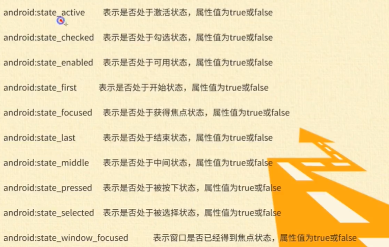

## 资源

### 字符串资源：strings.xml

字符串资源文件位于res/values目录下

根元素是<resource></resource>标记

使用<string></string>的name属性设置字符串的名称

起始标记<string>和结束标记</string>中间添加文本

### 颜色资源：colors.xml

颜色资源文件位于res/values目录下

根元素是<resource></resource>标记

使用<color></color>定义颜色资源得名称

使用name属性设置颜色资源的名称

起始标记<color>和结束标记</color>中间添加颜色值

### 尺寸资源：dimen.xml

尺寸资源文件位于res/values目录下

根元素是<resource></resource>标记

使用<dimen></dimen>标记定义各尺寸资源

使用name属性来指定尺寸资源的名称

起始标记<color>和结束标记</color>中间定义尺寸常量

### 数组资源：arrays.xml

尺寸资源文件位于res/values目录下

根元素是<resource></resource>标记

**包含三个子元素**

- <array/>子元素：用于定义普通类型的数组
- <integer-array>子元素：用于定义整数数组
- <string-arrya>子元素：用于定义字符串数组

```xml
<string-array name="list">
    <item>张三</item>
    <item>李四</item>
    <item>王五</item>
</string-array>
```

### stateListDrawable资源

定义在xml文件中的drawable对象，能根据状态来呈现不同的图像

存放在：**res/drawable-xxx目录中**

