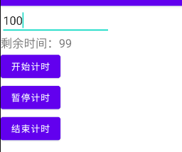

## 倒计时

[Android 倒计时的五种实现方式 - 简书 (jianshu.com)](https://www.jianshu.com/p/e3c055a39e47)

### 使用CountDownTimer

```java
new CountDownTimer(总时间, 时间间隔) {

    //执行方法
    @Override
    public void onTick(long millisUntilFinished) {
        
    }

    //结束方法
    @Override
    public void onFinish() {
        
    }
};

countDownTimer.start()：执行
countDownTimer.cancel()：取消
```


#### 实现效果




#### xml实现

```xml
<?xml version="1.0" encoding="utf-8"?>
<LinearLayout xmlns:android="http://schemas.android.com/apk/res/android"
    xmlns:app="http://schemas.android.com/apk/res-auto"
    xmlns:tools="http://schemas.android.com/tools"
    android:layout_width="match_parent"
    android:layout_height="match_parent"
    android:orientation="vertical"
    tools:context=".countDown.CountDownActivity">

    <EditText
        android:id="@+id/editText"
        android:layout_width="wrap_content"
        android:layout_height="wrap_content"
        android:hint="请输入倒计时的数字"
        android:inputType="number"/>

    <TextView
        android:id="@+id/countTimer"
        android:layout_width="wrap_content"
        android:layout_height="wrap_content"
        android:textSize="18sp" />

    <Button
        android:id="@+id/startPlay"
        android:layout_width="wrap_content"
        android:layout_height="wrap_content"
        android:text="开始计时"/>

    <Button
        android:id="@+id/suspendPlay"
        android:layout_width="wrap_content"
        android:layout_height="wrap_content"
        android:text="暂停计时"
        android:visibility="invisible"/>

    <Button
        android:id="@+id/finishPlay"
        android:layout_width="wrap_content"
        android:layout_height="wrap_content"
        android:text="结束计时"
        android:visibility="invisible"/>

</LinearLayout>
```

#### Java实现

```java
public class CountDownActivity extends AppCompatActivity implements View.OnClickListener {

    private EditText editText;
    private Button startPlay, finishPlay, suspendPlay;
    private TextView countTimer;
    private long surplusTime;
    private CountDownTimer countDownTimer;
    private boolean isCountDownTimer = false;   //防止重复执行倒计时
    private boolean flag = false;   //停止和继续执行倒计时

    @Override
    protected void onCreate(Bundle savedInstanceState) {
        super.onCreate(savedInstanceState);
        setContentView(R.layout.activity_count_down);

        editText = findViewById(R.id.editText);
        startPlay = findViewById(R.id.startPlay);
        finishPlay = findViewById(R.id.finishPlay);
        suspendPlay = findViewById(R.id.suspendPlay);
        countTimer = findViewById(R.id.countTimer);

        startPlay.setOnClickListener(this);
        finishPlay.setOnClickListener(this);
        suspendPlay.setOnClickListener(this);
    }

    private void initCountDownTimer(long time){
        countDownTimer = new CountDownTimer(time, 1000) {

            @Override
            public void onTick(long millisUntilFinished) {
                //获取剩余的时间
                surplusTime = millisUntilFinished;
                String value = String.valueOf(millisUntilFinished / 1000);
                countTimer.setText("剩余时间：" + value);
            }

            @Override 
            public void onFinish() {
                countTimer.setText("倒计时已经完成...");
                isCountDownTimer = false;
            }
        };
    }

    @Override
    public void onClick(View v) {
        switch (v.getId()){
            case R.id.startPlay:    //开始计时
                if (isCountDownTimer){
                    Toast.makeText(this, "倒计时正在运行中...", Toast.LENGTH_SHORT).show();
                    return;
                }

                long time = Long.parseLong(editText.getText().toString());
                initCountDownTimer(time * 1000);
                countDownTimer.start();
                isCountDownTimer = true;

                suspendPlay.setVisibility(View.VISIBLE);
                finishPlay.setVisibility(View.VISIBLE);

                break;
            case R.id.finishPlay:   //结束计时
                surplusTime = 0;
                countTimer.setText("剩余时间：" + 0);
                suspendPlay.setText("暂停计时");
                suspendPlay.setVisibility(View.INVISIBLE);
                finishPlay.setVisibility(View.INVISIBLE);
                countDownTimer.cancel();
                isCountDownTimer = false;
                break;
            case R.id.suspendPlay:  //暂停计时
                if (flag){
                    if (surplusTime != 0){
                        initCountDownTimer(surplusTime);
                        countDownTimer.start();
                        suspendPlay.setText("暂停计时");
                        flag = false;
                    }
                }else {
                    countDownTimer.cancel();
                    suspendPlay.setText("继续计时");
                    flag = true;
                }
                break;
        }
    }
}
```

