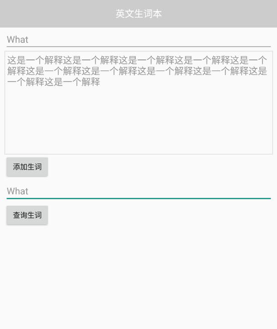

## 英语生词本

### 实现界面




### 实现功能

#### 1、数据库实现

```java
public class MySqlLite extends SQLiteOpenHelper {
    public MySqlLite(@Nullable Context context) {
        super(context, "news_words.db", null, 1);
    }

    @Override
    public void onCreate(SQLiteDatabase db) {
        String sql = "create table new_words(" +
                "id integer primary key autoincrement," +
                "new_word varchar(50)," +
                "explains varchar(50)" +
                ")";
        db.execSQL(sql);
    }

    @Override
    public void onUpgrade(SQLiteDatabase db, int oldVersion, int newVersion) {

    }
}
```

#### 2、首页实现

##### 布局文件

```xml
<?xml version="1.0" encoding="utf-8"?>
<LinearLayout xmlns:android="http://schemas.android.com/apk/res/android"
    xmlns:app="http://schemas.android.com/apk/res-auto"
    xmlns:tools="http://schemas.android.com/tools"
    android:layout_width="match_parent"
    android:layout_height="match_parent"
    android:orientation="vertical"
    tools:context=".newWordBook.MainActivity">

    <LinearLayout
        android:layout_width="match_parent"
        android:layout_height="wrap_content"
        android:paddingTop="15dp"
        android:paddingBottom="15dp"
        android:gravity="center_horizontal"
        android:background="#ccc">

        <TextView
            android:layout_width="wrap_content"
            android:layout_height="wrap_content"
            android:text="英文生词本"
            android:textColor="#fff"
            android:textSize="18sp"/>

    </LinearLayout>

    <LinearLayout
        android:layout_width="match_parent"
        android:layout_height="wrap_content"
        android:orientation="vertical"
        android:layout_marginLeft="10dp"
        android:layout_marginRight="10dp">

        <EditText
            android:id="@+id/inputEnglish"
            android:layout_width="match_parent"
            android:layout_height="wrap_content"
            android:hint="请输入英文"/>

        <EditText
            android:id="@+id/inputExplain"
            android:layout_width="match_parent"
            android:layout_height="200dp"
            android:gravity="left"
            android:background="@drawable/input_explain"
            android:hint="请输入解释"
            android:padding="5dp"/>

        <Button
            android:layout_width="wrap_content"
            android:layout_height="wrap_content"
            android:text="添加生词"
            android:onClick="addNewWords"/>

        <EditText
            android:id="@+id/findNewWords"
            android:layout_width="match_parent"
            android:layout_height="wrap_content"
            android:hint="请输入要查询的单词或者解释"/>

        <Button
            android:layout_width="wrap_content"
            android:layout_height="wrap_content"
            android:text="查询生词"
            android:onClick="queryNewWords"/>

    </LinearLayout>

</LinearLayout>
```

##### Java实现

```java
public class MainActivity extends Activity {

    private EditText inputEnglish, inputExplain, findNewWords;
    private SQLiteDatabase database;

    @Override
    protected void onCreate(Bundle savedInstanceState) {
        super.onCreate(savedInstanceState);
        setContentView(R.layout.activity_main2);

        initView();
    }

    /**
     * 初始化控件
     */
    private void  initView(){
        inputEnglish = findViewById(R.id.inputEnglish);
        inputExplain = findViewById(R.id.inputExplain);
        findNewWords = findViewById(R.id.findNewWords);

        //获取Sqlite数据库对象
        MySqlLite mySqlLite = new MySqlLite(getApplicationContext());
        database = mySqlLite.getWritableDatabase();
    }

    /**
     * 添加生词本
     * @param view
     */
    public void addNewWords(View view) {
        //判断输入是否为空
        if (inputEnglish.getText().toString().equals("")){
            Toast.makeText(this, "输入的单词不能为空", Toast.LENGTH_SHORT).show();
            return;
        }

        if (inputExplain.getText().toString().equals("")){
            Toast.makeText(this, "输入的解释不能为空", Toast.LENGTH_SHORT).show();
            return;
        }

        //插入数据
        String insertSql = "insert into new_words(new_word, explains) values(?, ?)";
        database.execSQL(insertSql, new Object[]{
                inputEnglish.getText().toString(),
                inputExplain.getText().toString()
        });
        Toast.makeText(this, "生词插入成功", Toast.LENGTH_SHORT).show();
    }

    /**
     *
     * @param view
     */
    public void queryNewWords(View view) {
        //判断输入是否为空
        if(findNewWords.getText().toString().equals("")){
            Toast.makeText(this, "输入的生词不能为空", Toast.LENGTH_SHORT).show();
            return;
        }

        //查询数据
        String selectSql = "select * from new_words where new_word like ? or explains like ?";
        Cursor cursor = database.rawQuery(selectSql, new String[]{
                "%" + findNewWords.getText().toString() + "%",
                "%" + findNewWords.getText().toString() + "%",
        });

        //将查询得数据放入集合中
        ArrayList<Map<String, String>> arrayList = new ArrayList<>();
        while (cursor.moveToNext()){
            Map<String, String> stringStringMap = new HashMap<>();
            stringStringMap.put("id", cursor.getString(cursor.getColumnIndex("id")));
            stringStringMap.put("new_word", cursor.getString(cursor.getColumnIndex("new_word")));
            stringStringMap.put("explains", cursor.getString(cursor.getColumnIndex("explains")));
            arrayList.add(stringStringMap);
        }

        //将存入的数据发送到另外的Activity中
        Bundle bundle = new Bundle();
        bundle.putSerializable("newWordData", arrayList);
        Intent intent = new Intent(getApplicationContext(), ShowActivity.class);
        intent.putExtra("newWordBundle", bundle);
        startActivity(intent);
    }
}
```

#### 3、显示数据实现

##### 布局文件

```xml
<?xml version="1.0" encoding="utf-8"?>
<LinearLayout xmlns:android="http://schemas.android.com/apk/res/android"
    xmlns:app="http://schemas.android.com/apk/res-auto"
    xmlns:tools="http://schemas.android.com/tools"
    android:layout_width="match_parent"
    android:layout_height="match_parent"
    android:orientation="vertical"
    tools:context=".newWordBook.ShowActivity">

    <RelativeLayout
        android:layout_width="match_parent"
        android:layout_height="wrap_content"
        android:paddingTop="15dp"
        android:paddingBottom="15dp"
        android:background="#ccc">

        <ImageView
            android:layout_width="wrap_content"
            android:layout_height="wrap_content"
            android:src="@drawable/left_arrow"
            android:onClick="finish"/>

        <TextView
            android:layout_width="wrap_content"
            android:layout_height="wrap_content"
            android:text="英文生词本"
            android:textColor="#fff"
            android:textSize="18sp"
            android:layout_centerHorizontal="true"/>

    </RelativeLayout>

    <androidx.recyclerview.widget.RecyclerView
        android:id="@+id/newWordList"
        android:layout_width="match_parent"
        android:layout_height="wrap_content" />

</LinearLayout>
```

##### java实现

```java
public class ShowActivity extends Activity {

    private RecyclerView newWordList;
    private ArrayList<Map<String, String>> newWordData;

    @Override
    protected void onCreate(Bundle savedInstanceState) {
        super.onCreate(savedInstanceState);
        setContentView(R.layout.activity_show);

        newWordList = findViewById(R.id.newWordList);

        //获取生词本数据
        Bundle newWordBundle = getIntent().getBundleExtra("newWordBundle");
        newWordData = (ArrayList<Map<String, String>>) newWordBundle.getSerializable("newWordData");

        //设置RecyclerView
        LinearLayoutManager linearLayoutManager = new LinearLayoutManager(this, LinearLayoutManager.VERTICAL, false);
        newWordList.setLayoutManager(linearLayoutManager);
        newWordList.setAdapter(new NewWordAdapter());
        newWordList.addItemDecoration(new DividerItemDecoration(getApplicationContext(), DividerItemDecoration.VERTICAL));
    }

    /**
     * 关闭Activity
     * @param view
     */
    public void finish(View view) {
        finish();
    }

    /**
     * 设置RecyclerView的适配器
     */
    class NewWordAdapter extends RecyclerView.Adapter{

        @NonNull
        @NotNull
        @Override
        public RecyclerView.ViewHolder onCreateViewHolder(@NonNull @NotNull ViewGroup parent, int viewType) {
            View view = LayoutInflater.from(getApplicationContext()).inflate(R.layout.recyclerview_new_words, parent, false);
            return new NewWordHolder(view);
        }

        @Override
        public void onBindViewHolder(@NonNull @NotNull RecyclerView.ViewHolder holder, int position) {
            //获取数据
            Map<String, String> stringStringMap = newWordData.get(position);
            ((NewWordHolder) holder).recyclerViewNewWord.setText(stringStringMap.get("new_word"));
            ((NewWordHolder) holder).recyclerViewExplain.setText(stringStringMap.get("explains"));

            //删除数据
            ((NewWordHolder) holder).delete.setOnClickListener(new View.OnClickListener() {
                @Override
                public void onClick(View v) {
                    //点击是否删除数据项
                    new AlertDialog.Builder(ShowActivity.this)
                            .setTitle("确定是否要删除？")
                            .setMessage("是否删除当前生词本，删除后将无法恢复")
                            .setNegativeButton("确定", new DialogInterface.OnClickListener() {
                                @Override
                                public void onClick(DialogInterface dialog, int which) {
                                    //获取sqlite数据库对象
                                    MySqlLite mySqlLite = new MySqlLite(getApplication());
                                    SQLiteDatabase database = mySqlLite.getWritableDatabase();
                                    String deleteSql = "delete from new_words where id = ?";
                                    database.execSQL(deleteSql, new Object[]{
                                            newWordData.get(position).get("id")
                                    });

                                    //删除RecyclerView单独的数据项
                                    notifyItemRemoved(position);
                                    newWordData.remove(position);
                                }
                            })
                            .setPositiveButton("取消", new DialogInterface.OnClickListener() {
                                @Override
                                public void onClick(DialogInterface dialog, int which) {
                                    dialog.dismiss();
                                }
                            })
                            .create()
                            .show();
                }
            });
        }

        @Override
        public int getItemCount() {
            return newWordData.size();
        }

        class NewWordHolder extends RecyclerView.ViewHolder{

            private TextView recyclerViewNewWord;
            private TextView recyclerViewExplain;
            private Button delete;

            public NewWordHolder(@NonNull @NotNull View itemView) {
                super(itemView);

                recyclerViewNewWord = itemView.findViewById(R.id.newWord);
                recyclerViewExplain = itemView.findViewById(R.id.explain);
                delete = itemView.findViewById(R.id.delete);
            }
        }
    }

}
```

